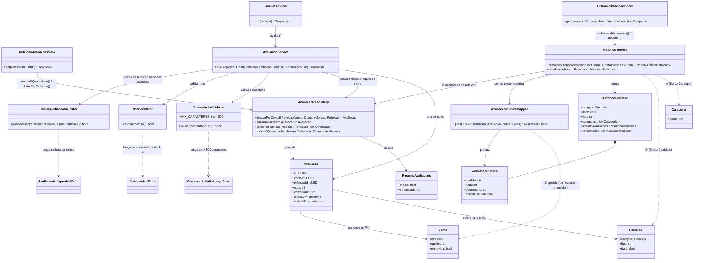

# Arquitetura C4 — Nível 4 (Avaliação) — Bandejão

> Detalha, em diagrama de classes, o componente **Avaliação**, desenhado no
> Nível 3 do backend (ver `c4-nivel-3-backend.md`). Cobre o Épico Avaliação
> por inteiro: avaliação por estrelas e comentário (RF15) e histórico de
> refeições anteriores (RF16).
>
> Este componente **lê, mas não escreve**, em dois models de outros
> componentes: `Conta` (Cadastro/Autenticação, para obter o apelido do
> autor) e `Refeicao`/`Categoria`/`Prato` (Cardápio, para montar o
> histórico do RF16) — a mesma relação de leitura entre apps que já aparece
> entre Leitor de Cardápio e Exposição do Cardápio. Nenhuma chamada entre
> componentes é desenhada por isso (ver nota do Nível 3): é sempre leitura
> via *foreign key* no mesmo banco.

## Nível 4 — Diagrama de Classes da Avaliação

### Notas do diagrama

- **`AvaliacaoService.avaliar` é sempre um upsert**, nunca um "criar" e um
  "editar" separados: o RF15 define que a segunda tentativa de avaliar a
  mesma refeição edita a anterior, e a janela de edição ("até 23h59 do
  mesmo dia") coincide, na prática, com a própria janela de avaliação
  ("refeições do dia corrente, já iniciadas") — depois desse horário, a
  refeição deixa de ser "do dia corrente" e `JanelaAvaliacaoValidator`
  já rejeitaria uma nova tentativa de avaliar por outro motivo. Por isso
  não existe uma regra de edição separada da regra de criação neste
  desenho: as duas dependem da mesma validação de janela.
- **`JanelaAvaliacaoValidator` reaproveita o mesmo tipo de parâmetro do
  Anexo A** (horários de café/almoço/jantar) já usado por
  `HorarioRefeicaoResolver` no componente Exposição do Cardápio — é a
  mesma fonte de configuração, lida por dois componentes diferentes, não
  uma cópia dela.
- **Nota e comentário têm validadores próprios**, separados do
  `AvaliacaoService`, pelo mesmo motivo dos validadores dos outros
  componentes (Matrícula, no Cadastro/Autenticação): são regras
  isoladas — nota obrigatória de 1 a 5, comentário opcional até 500
  caracteres — testáveis sem precisar simular uma refeição completa.
- **`AvaliacaoPublicaMapper` é o único lugar por onde uma `Conta` vira
  visível para terceiros**, e ele deliberadamente só extrai o apelido —
  nunca a matrícula/SIAPE ou o e-mail (RI10, RNF04). Também é aqui que a
  exclusão de conta (RNF07) se reflete: se `Conta.removida` for
  verdadeiro, o mapper devolve "usuário removido" no lugar do apelido, em
  vez de a avaliação sumir — a RNF07 exige que a avaliação em si
  permaneça, só o autor fica anônimo.
- **`Avaliacao.contaId` nunca é apagado, mesmo com a conta removida** —
  é o vínculo permanente exigido pela RNF08 (rastreabilidade e moderação:
  a equipe precisa conseguir identificar o autor de uma avaliação
  problemática por consulta administrativa manual, o mesmo acesso direto
  ao banco já desenhado no Nível 3, ADR 0004). O `AvaliacaoPublicaMapper`
  só controla o que é exibido publicamente; o dado de rastreabilidade
  continua inteiro no banco.
- **`HistoricoService` não tem nenhuma lógica de escrita nem de filtro**
  (RF08/RF09 não se aplicam ao histórico) — é deliberadamente mais simples
  que `CardapioQueryService` (Exposição do Cardápio): RF16 pede consulta
  somente leitura por campus, data e refeição, cardápio completo, sem
  marcador nem dieta selecionáveis.
- **Nenhuma nova classe para "refeições de semanas anteriores somem da
  interface mas continuam armazenadas" (RF15/L09)** — isso já é uma
  consequência de `RefeicaoAvaliacoesView` (usada junto ao cardápio da
  semana vigente) e `HistoricoRefeicoesView` (RF16) serem endpoints
  diferentes: o dado nunca é apagado, só para de aparecer pela primeira
  via depois que a semana passa.
- Este diagrama é uma **proposta de decomposição inicial**, não uma
  decisão de arquitetura registrada — ajuste-o se a dupla responsável por
  esta frente encontrar um desenho de classes diferente ao implementar.
