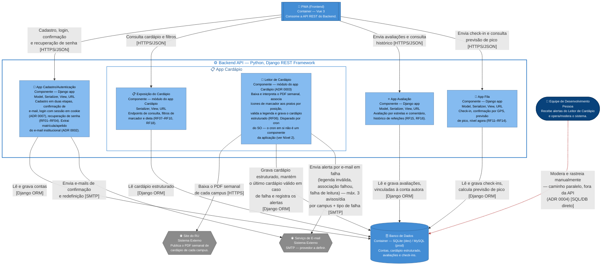

# Arquitetura C4 — Nível 3 (Backend) — Bandejão

> Continuação de `c4-niveis-1-2.md`. Este documento decompõe o container
> "Backend API" do Nível 2 em seus componentes internos (apps Django) e é
> **único para o backend inteiro** — não se repete por Épico.
>
> Os diagramas de **Nível 4** (classes), um por Épico/componente, ficam em
> arquivos separados, cada um referenciando o componente correspondente
> deste Nível 3:
>
> - ✅ `c4-nivel-4-leitor-cardapio.md` — Épico Cardápio (parte de leitura) →
>   componente Leitor de Cardápio
> - ✅ `c4-nivel-4-cadastro-autenticacao.md` — Épico Login → componente
>   Cadastro/Autenticação
> - ✅ `c4-nivel-4-exposicao-cardapio.md` — Épico Cardápio (parte de
>   exibição) → componente Exposição do Cardápio
> - ✅ `c4-nivel-4-avaliacao.md` — Épico Avaliação → componente Avaliação
> - ✅ `c4-nivel-4-fila.md` — Épico Fila e Previsão de Pico → componente
>   Fila
>
> Referências: ADR 0003 — *Leitor de PDF como módulo do backend*, ADR 0004 —
> *Acesso direto da equipe ao banco*, ADR 0005 — *Filtros de marcador e de
> dieta no backend*, ADR 0006 — *Alerta de falha do leitor por e-mail* e
> ADR 0007 — *Sessão autenticada por cookie HttpOnly*, todas em
> `docs/arquitetura/adr/`.
>
> Todo este backend faz parte da **Release 2**. No protótipo da Release 1, um
> backend simulado dentro do frontend faz o papel desta API.

### Legenda de formas (Nível 3)

Mesma legenda do Nível 1/2, com um acréscimo:

| Forma | Tipo de elemento | Exemplo |
|---|---|---|
| ⬭ Oval (estádio) | Pessoa | Equipe de Desenvolvimento |
| ▤ Retângulo de barras duplas | Container (fora do escopo deste diagrama, mostrado como vizinho) | PWA, Banco de Dados |
| ⬡ Hexágono | Sistema externo | Site do RU, Serviço de E-mail |
| ⛁ Cilindro | Banco de dados | Banco de Dados |
| ▭ Retângulo simples | **Componente** (app Django ou módulo dentro de um app) | App Cardápio, Leitor de Cardápio |

---

## Nível 3 — Diagrama de Componentes do Backend API

### Notas do diagrama

- **Um componente por app Django, seguindo a RNF06.** A separação
  Cadastro/Autenticação, Cardápio, Avaliação e Fila não é só uma
  conveniência de desenho: é a própria exigência de manutenibilidade do
  Documento de Requisitos ("a arquitetura deve separar claramente esses
  módulos, de modo que uma mudança no formato do PDF do cardápio exija
  alteração apenas no módulo de leitura de cardápio").
- **Nenhuma seta entre componentes.** Os apps Django deste backend não se
  chamam uns aos outros via HTTP interno nem import direto de lógica de
  negócio: é um monólito que compartilha um único banco, e a relação entre,
  por exemplo, uma Avaliação e o Usuário que a escreveu é uma *foreign key* no
  banco, não uma chamada entre componentes. Por isso todo componente se
  relaciona com o Banco de Dados, e não uns com os outros.
- **Leitor de Cardápio aparece dentro da fronteira do App Cardápio**, e não
  como um componente irmão solto, porque a ADR 0003 o define como módulo
  desse app, não como app à parte. Ainda assim ele está desenhado como caixa
  separada de "Exposição do Cardápio": as duas partes do app têm perfis bem
  diferentes — uma expõe endpoints de leitura para o PWA; a outra é
  disparada por cron, escreve no banco e depende de um sistema externo (Site
  do RU). Essa fronteira interna é exatamente o que o Nível 4 detalha (ver
  `c4-nivel-4-leitor-cardapio.md`).
- **Leitor de Cardápio → Serviço de E-mail é o canal de alerta à Equipe.**
  Reaproveita a mesma integração já usada por Cadastro/Autenticação para
  confirmação de cadastro e redefinição de senha (RF02, RF04), em vez de
  introduzir um canal novo. Para não virar ruído em caso de falha
  persistente, o envio é limitado a **no máximo 3 avisos por dia, por
  campus + tipo de falha** (detalhado no `AlertaEquipeService` em
  `c4-nivel-4-leitor-cardapio.md`) — decisão registrada na ADR 0006
  (`docs/arquitetura/adr/0006-alerta-de-falha-do-leitor-por-email.md`).
- **A relação Equipe → Banco de Dados continua tracejada e vermelha**
  (herdada do Nível 2, ADR 0004): é acesso administrativo direto e
  deliberado, de natureza diferente do alerta automático acima — por isso
  as duas exceções ao fluxo normal permanecem visualmente distintas.
- **App Fila** entra na Release 2 (RF11–RF14), com o check-in em produção
  até 03/11/2026 (marco MC-01 do backlog).
