# Arquitetura C4 — Nível 4 (Cadastro/Autenticação) — Bandejão

> Detalha, em diagrama de classes, o componente **Cadastro/Autenticação**,
> desenhado no Nível 3 do backend (ver `c4-nivel-3-backend.md`). Cobre o
> Épico Login por inteiro: cadastro em duas etapas (RF01), confirmação de
> e-mail (RF02), login (RF03) e recuperação de senha (RF04).
>
> Referência: ADR 0002 — *Matrícula e apelido extraídos do e-mail
> institucional* (`docs/adr/0002-matricula-apelido-extraidos-do-email.md`).

## Nível 4 — Diagrama de Classes do Cadastro/Autenticação

É o componente com mais regras de negócio isoladas e testáveis do backend,
o que pesa bastante para a meta de 60% de cobertura em módulos críticos
(RNF06, que cita "cadastro e autenticação" nominalmente).

```mermaid
classDiagram
  class TipoUsuario {
    <<enumeration>>
    ESTUDANTE
    PROFESSOR_SERVIDOR
  }

  class CadastroView {
    +post(request) Response
  }
  class ConfirmacaoEmailView {
    +get(token: str) Response
  }
  class ReenvioConfirmacaoView {
    +post(request) Response
  }
  class LoginView {
    +post(request) Response
  }
  class SolicitarRecuperacaoSenhaView {
    +post(request) Response
  }
  class RedefinirSenhaView {
    +post(token: str, request) Response
  }

  class CadastroService {
    +registrar(tipoUsuario: TipoUsuario, dados: dict) Conta
  }

  class IdentificadorExtractor {
    <<interface>>
    +extrair(dados: dict) IdentificadorExtraido
  }
  class EstudanteIdentificadorExtractor {
    +extrair(dados: dict) IdentificadorExtraido
  }
  class ProfessorServidorIdentificadorExtractor {
    +extrair(dados: dict) IdentificadorExtraido
  }
  class IdentificadorExtraido {
    +identificador: str
    +apelidoSugerido: str
  }

  class MatriculaValidator {
    +validarFormato(matricula: str) bool
    +validarPrefixoAnoSemestre(matricula: str) bool
    +validarSequenciaDigitos(matricula: str) bool
  }
  class SiapeValidator {
    +validarFormato(siape: str) bool
  }
  class EmailInstitucionalValidator {
    +validarFormatoEstudante(email: str) bool
    +validarFormatoProfessorServidor(email: str) bool
  }

  class ApelidoResolver {
    +resolverManual(apelidoDigitado: str) str
    +resolverExtraido(textoAntesDoArroba: str) str
    -limparCaracteresNaoAlfanumericos(texto: str) str
    +validarDisponibilidade(apelido: str) bool
  }
  class ApelidoIndisponivelError

  class SenhaValidator {
    +validar(senha: str) bool
  }
  class PasswordHasher {
    +hash(senha: str) str
    +verificar(senha: str, hash: str) bool
  }

  class ContaRepository {
    +existeMatriculaOuSiape(identificador: str) bool
    +existeEmail(email: str) bool
    +buscarPorIdentificador(identificador: str) Conta
    +salvar(conta: Conta) Conta
    +excluirPendenteExpirada(conta: Conta) void
  }
  class IdentificadorJaCadastradoError
  class EmailJaCadastradoError

  class Conta {
    +id: UUID
    +tipoUsuario: TipoUsuario
    +identificadorCifrado: str
    +email: str
    +apelido: str
    +senhaHash: str
    +confirmada: bool
    +criadaEm: datetime
  }

  class ConfirmacaoEmailService {
    +enviarLink(conta: Conta) void
    +confirmar(token: str) void
    +reenviar(conta: Conta) void
  }
  class TokenConfirmacao {
    +token: str
    +contaId: UUID
    +criadoEm: datetime
    +expiraEm: datetime
    +usado: bool
  }
  class TokenExpiradoOuInvalidoError

  class ExclusaoCadastroPendenteJob {
    +executar() void
  }

  class LoginService {
    +autenticar(identificador: str, senha: str) Sessao
  }
  class TentativaLoginTracker {
    +registrarTentativa(identificador: str, sucesso: bool) void
    +estaBloqueado(identificador: str) bool
    -MAX_TENTATIVAS: int = 5
    -JANELA: timedelta = 10min
    -BLOQUEIO: timedelta = 10min
  }
  class ContaNaoConfirmadaError
  class CredenciaisInvalidasError
  class Sessao {
    +contaId: UUID
    +criadaEm: datetime
  }

  class RecuperacaoSenhaService {
    +solicitar(identificador: str) void
    +redefinir(token: str, novaSenha: str) void
  }
  class TokenRedefinicaoSenha {
    +token: str
    +contaId: UUID
    +criadoEm: datetime
    +expiraEm: datetime
    +usado: bool
  }
  class SolicitacaoRedefinicaoTracker {
    +podeSolicitar(identificador: str) bool
    -MAX_POR_HORA: int = 3
  }

  class EmailSvc["Serviço de E-mail (externo)"] {
    <<external>>
  }

  CadastroView --> CadastroService : registrar()
  ConfirmacaoEmailView --> ConfirmacaoEmailService : confirmar()
  ReenvioConfirmacaoView --> ConfirmacaoEmailService : reenviar()
  LoginView --> LoginService : autenticar()
  SolicitarRecuperacaoSenhaView --> RecuperacaoSenhaService : solicitar()
  RedefinirSenhaView --> RecuperacaoSenhaService : redefinir()

  IdentificadorExtractor <|.. EstudanteIdentificadorExtractor
  IdentificadorExtractor <|.. ProfessorServidorIdentificadorExtractor
  IdentificadorExtractor --> IdentificadorExtraido : produz

  CadastroService --> IdentificadorExtractor : escolhe estratégia por TipoUsuario
  CadastroService --> MatriculaValidator : valida (Estudante)
  CadastroService --> SiapeValidator : valida (Professor/Servidor)
  CadastroService --> EmailInstitucionalValidator : valida formato
  CadastroService --> ApelidoResolver : resolve/valida apelido
  ApelidoResolver ..> ApelidoIndisponivelError : lança se indisponível
  CadastroService --> SenhaValidator : valida senha
  SenhaValidator --> PasswordHasher : gera hash
  CadastroService --> ContaRepository : verifica duplicidade / salva
  ContaRepository ..> IdentificadorJaCadastradoError : lança se já em uso
  ContaRepository ..> EmailJaCadastradoError : lança se já em uso
  CadastroService --> Conta : cria (pendente)
  CadastroService --> ConfirmacaoEmailService : dispara envio de link

  ConfirmacaoEmailService --> TokenConfirmacao : gera/consome
  ConfirmacaoEmailService ..> TokenExpiradoOuInvalidoError : lança se inválido/expirado
  ConfirmacaoEmailService --> ContaRepository : marca confirmada
  ConfirmacaoEmailService ..> EmailSvc : envia link [SMTP]
  ExclusaoCadastroPendenteJob --> ContaRepository : exclui pendentes expiradas

  LoginService --> TentativaLoginTracker : verifica bloqueio / registra tentativa
  LoginService --> ContaRepository : busca conta
  LoginService --> PasswordHasher : verifica senha
  LoginService ..> ContaNaoConfirmadaError : lança se conta pendente
  LoginService ..> CredenciaisInvalidasError : lança em erro (mensagem genérica)
  LoginService --> Sessao : cria, em sucesso

  RecuperacaoSenhaService --> SolicitacaoRedefinicaoTracker : limita 3/hora
  RecuperacaoSenhaService --> TokenRedefinicaoSenha : gera/consome
  RecuperacaoSenhaService --> ContaRepository : busca conta / atualiza senha
  RecuperacaoSenhaService --> PasswordHasher : gera hash da nova senha
  RecuperacaoSenhaService ..> EmailSvc : envia link [SMTP]

  ContaRepository ..> Conta : grava/lê
  Conta --> TipoUsuario : tem
```

### Notas do diagrama

- **`IdentificadorExtractor` é uma estratégia por `TipoUsuario`** — a
  distinção entre Estudante e Professor/Servidor do RF01/ADR 0002 (quem
  digita o quê, e o que é extraído do e-mail) fica isolada nas duas
  implementações, em vez de virar um emaranhado de `if tipo == ...` dentro
  do `CadastroService`. Isso deixa mais fácil testar as duas regras da ADR
  0002 separadamente: para Estudante, a matrícula vem do e-mail e o apelido
  é digitado; para Professor/Servidor, é o inverso.
- **`ApelidoResolver` concentra as três variações da regra de apelido**:
  aceitar o valor digitado (Estudante), extrair e limpar caracteres não
  alfanuméricos do texto antes do "@" (Professor/Servidor), e validar
  disponibilidade/tamanho nos dois casos. A colisão ou o tamanho inválido
  do apelido extraído automaticamente não é tratada como erro fatal do
  cadastro: o RF01 pede que, nesse caso específico, o sistema **peça um
  apelido alternativo digitado manualmente**, em vez de simplesmente
  rejeitar o cadastro — vale essa distinção na hora de implementar
  `ApelidoIndisponivelError` (é recuperável, não é o mesmo tipo de falha que
  matrícula/e-mail duplicados).
- **`MatriculaValidator` tem três métodos separados**, não um só
  `validar()`, porque o RF01 define três checagens compostas e
  independentes: formato (9 dígitos), prefixo de ano/semestre (janela
  dinâmica, recalculada a cada semestre conforme o Anexo A) e sequência dos
  6 dígitos restantes (rejeita crescente, decrescente ou todos iguais).
  Métodos separados tornam cada regra testável isoladamente com casos de
  borda próprios, sem depender de montar uma matrícula "válida no resto"
  só para testar uma das três checagens.
- **`Conta.identificadorCifrado` é armazenado de forma recuperável**, não
  como hash irreversível — diferente de `senhaHash`. Isso segue a RNF07: a
  equipe precisa conseguir recuperar a matrícula/SIAPE a partir do apelido
  para tratar matrícula contestada (L01) e para moderação (RNF08), então não
  pode ser um hash de mão única como a senha; deve ser criptografia
  simétrica ou equivalente, com a chave restrita à equipe. Essa distinção —
  dado recuperável vs. dado irreversível — é proposital e não deve ser
  "simplificada" para os dois usarem o mesmo mecanismo na implementação.
- **`ExclusaoCadastroPendenteJob` é um job separado do `CadastroService`**,
  análogo ao `LerCardapioCommand` do Leitor de Cardápio: o RF02 exige que um
  cadastro pendente não confirmado em 24h seja excluído automaticamente,
  o que é responsabilidade de um processo periódico (cron ou scheduler),
  não de uma ação disparada por requisição HTTP. Ainda não está definido
  nos documentos enviados se roda por cron do SO (como o Leitor de
  Cardápio) ou por outro mecanismo — vale alinhar isso junto com a mesma
  decisão de infraestrutura do RF06.
- **`TentativaLoginTracker` e `SolicitacaoRedefinicaoTracker` são duas
  classes, não uma genérica de "rate limiting"**, porque os parâmetros e a
  granularidade são diferentes: bloqueio de login é por identificador, 5
  tentativas em 10 minutos, bloqueio de 10 minutos (RF03); recuperação de
  senha é por identificador, 3 solicitações por hora (RF04). Também evita
  que uma implementação genérica demais esconda esses números do Anexo A
  atrás de uma configuração difícil de rastrear até o requisito.
- **`LoginService` nunca deixa a `LoginView` saber se a matrícula/SIAPE
  existe** — tanto `ContaNaoConfirmadaError` quanto `CredenciaisInvalidasError`
  viram mensagens específicas de propósito diferente (uma convida a
  confirmar o e-mail; a outra é genérica de propósito, para não permitir
  enumeração de contas, RF03) — mas nenhuma das duas revela existência da
  conta a quem não sabe a senha correta.
