# Arquitetura C4 — Nível 4 (Exposição do Cardápio) — Bandejão

> Detalha, em diagrama de classes, o componente **Exposição do Cardápio**,
> desenhado no Nível 3 do backend dentro da fronteira do App Cardápio (ver
> `c4-nivel-3-backend.md`), ao lado do Leitor de Cardápio
> (`c4-nivel-4-leitor-cardapio.md`) — os dois compartilham os mesmos models
> Django (`Refeicao`, `Categoria`, `Prato`, `Marcador`), mas um escreve e o
> outro só lê. Cobre a parte de exibição do Épico Cardápio: exibição por
> campus/refeição/dia (RF07), filtro de marcadores (RF08), filtro de dieta
> (RF09) e exibição da semana seguinte (RF18).
>
> **Decisão tomada neste refinamento:** os filtros de marcador (RF08) e de
> dieta (RF09) são aplicados **no backend** — o endpoint recebe os
> marcadores/dieta selecionados como parâmetros e já devolve o cardápio
> filtrado, em vez de o PWA filtrar um cardápio bruto já carregado. Isso é
> o que justifica `FiltroMarcadorService` e `FiltroDietaService` existirem
> como serviços de backend testáveis à parte, e não apenas como lógica no
> Vue. Decisão registrada na ADR 0005
> (`docs/arquitetura/adr/0005-filtros-de-marcador-e-dieta-no-backend.md`).
>
> **Protótipo da Release 1.** Como ainda não há backend, o protótipo aplica
> os mesmos filtros no navegador (`frontend/src/utils/cardapio.js`), com a
> mesma regra deste desenho: o prato com marcador evitado continua visível e
> é sinalizado, e a categoria recebe `semOpcaoCompativel` quando todos os
> pratos são sinalizados. Na Release 2, esse código sai do frontend e a
> regra passa a rodar aqui.

## Nível 4 — Diagrama de Classes da Exposição do Cardápio

```mermaid
classDiagram
  class CardapioView {
    +get(request) Response
  }

  class CardapioQueryService {
    +obterCardapio(campus: Campus, semana: Semana, dia: date, refeicao: str, marcadoresSelecionados: list~str~, dieta: DietaSelecionada) CardapioFiltrado
  }

  class RefeicaoRepository {
    +buscarRefeicao(campus: Campus, data: date, tipo: str) Refeicao
    +refeicoesDoDia(campus: Campus, data: date) list~Refeicao~
    +existeCardapioPublicado(campus: Campus, semana: Semana) bool
  }

  class HorarioRefeicaoResolver {
    +refeicaoEmAndamento(agora: datetime, refeicoesDoDia: list~Refeicao~) str
    +proximaRefeicao(agora: datetime, refeicoesDoDia: list~Refeicao~) str
  }
  class HorariosRefeicaoConfig {
    +horarioCafe: tuple
    +horarioAlmoco: tuple
    +horarioJantar: tuple
  }

  class SemanaCardapioResolver {
    +semanasDisponiveis(campus: Campus) list~Semana~
  }
  class Semana {
    +inicio: date
    +fim: date
    +vigente: bool
  }

  class DietaSelecionada {
    <<enumeration>>
    SEM_FILTRO
    OVOLACTOVEGETARIANO
    VEGETARIANO_ESTRITO
  }

  class FiltroDietaService {
    +aplicar(refeicao: Refeicao, dieta: DietaSelecionada) list~Categoria~
  }

  class FiltroMarcadorService {
    +aplicar(categorias: list~Categoria~, marcadoresSelecionados: list~str~, alergenosIndisponivel: bool) list~CategoriaFiltrada~
    -contemTodosMarcados(pratos: list~Prato~, marcadoresSelecionados: list~str~) bool
  }

  class CardapioFiltrado {
    +campus: Campus
    +refeicao: str
    +data: date
    +status: StatusCardapio
    +avisoSujeitoAAlteracao: str
    +alergenosIndisponivel: bool
    +filtroMarcadorDesativado: bool
    +categorias: list~CategoriaFiltrada~
  }
  class StatusCardapio {
    <<enumeration>>
    PUBLICADO
    NAO_PUBLICADO
  }
  class CategoriaFiltrada {
    +nome: str
    +semOpcaoCompativel: bool
    +pratos: list~PratoFiltrado~
  }
  class PratoFiltrado {
    +descricao: str
    +marcadores: list~str~
    +marcadoresSelecionados: list~str~
  }

  class Refeicao {
    +campus: Campus
    +tipo: str
    +data: date
    +alergenosIndisponivel: bool
  }
  class Categoria {
    +nome: str
    +dieta: str
  }
  class Prato {
    +descricao: str
  }
  class Marcador {
    +nome: str
  }

  CardapioView --> CardapioQueryService : obterCardapio()

  CardapioQueryService --> RefeicaoRepository : busca refeição(ões)
  CardapioQueryService --> HorarioRefeicaoResolver : resolve refeição padrão quando não informada (RF07)
  CardapioQueryService --> SemanaCardapioResolver : resolve semana vigente/seguinte (RF18)
  CardapioQueryService --> FiltroDietaService : 1. filtra por dieta (RF09)
  CardapioQueryService --> FiltroMarcadorService : 2. sinaliza marcadores (RF08)
  CardapioQueryService --> CardapioFiltrado : monta resposta

  HorarioRefeicaoResolver --> HorariosRefeicaoConfig : usa parâmetros do Anexo A
  SemanaCardapioResolver --> Semana : produz

  RefeicaoRepository ..> Refeicao : lê
  RefeicaoRepository ..> Categoria : lê
  RefeicaoRepository ..> Prato : lê
  RefeicaoRepository ..> Marcador : lê

  FiltroDietaService --> Categoria : lê linhas de dieta
  FiltroMarcadorService --> CategoriaFiltrada : produz
  FiltroMarcadorService --> PratoFiltrado : produz

  CardapioFiltrado --> StatusCardapio : tem
  CardapioFiltrado *-- CategoriaFiltrada
  CategoriaFiltrada *-- PratoFiltrado
```

### Notas do diagrama

- **A decisão de filtrar no backend é o que dá origem a
  `FiltroDietaService` e `FiltroMarcadorService` como classes próprias**,
  em vez de o `CardapioQueryService` devolver um cardápio bruto para o Vue
  filtrar. Cada serviço cobre uma regra de negócio isolada e testável sem
  precisar simular a interface — bom para a meta de cobertura da RNF06 — e
  os dois são aplicados em sequência (`CardapioQueryService` chama primeiro
  `FiltroDietaService`, depois `FiltroMarcadorService`), porque a dieta pode
  esconder categorias/linhas inteiras (RF09) e o filtro de marcador só
  precisa então avaliar o que sobrou.
- **`FiltroMarcadorService.aplicar` recebe `alergenosIndisponivel` como
  parâmetro** para respeitar o RF08: se a refeição está marcada como
  "informação de alérgenos indisponível" (RF06/L03), o filtro fica
  desativado para ela — o serviço não aplica sinalização nenhuma e
  `CardapioFiltrado.filtroMarcadorDesativado` fica `true`, para a interface
  informar o motivo.
- **O filtro de marcador sinaliza, não oculta (RF08).** Todo prato continua
  na resposta; `PratoFiltrado.marcadoresSelecionados` traz os marcadores
  evitados que ele contém (lista vazia = prato não sinalizado), para a
  interface exibir o alerta "Contém: …".
- **`CategoriaFiltrada.semOpcaoCompativel`** cobre o caso do RF08 em que
  todos os pratos de uma categoria têm algum marcador selecionado — é uma
  informação calculada por `FiltroMarcadorService`, não um campo do model
  `Categoria`, porque depende da seleção de filtro de cada requisição, não
  é um dado fixo do cardápio.
- **`HorarioRefeicaoResolver` e `SemanaCardapioResolver` existem separados
  do `CardapioQueryService`** pelo mesmo motivo do `MatriculaValidator` no
  Cadastro/Autenticação: são duas regras de negócio compostas e
  independentes — "qual refeição está em andamento agora" (RF07, depende
  dos horários do Anexo A) e "a semana seguinte já pode ser exibida?"
  (RF18, depende só de o PDF daquela semana já ter sido lido com sucesso
  pelo Leitor de Cardápio) — testáveis cada uma com seus próprios casos de
  borda, sem precisar montar cenário completo de cardápio para testar só
  uma das duas.
- **`Refeicao`, `Categoria`, `Prato` e `Marcador` são os mesmos models do
  Nível 4 do Leitor de Cardápio** — aqui aparecem só como origem de leitura
  do `RefeicaoRepository`; nenhuma dessas classes é escrita por este
  componente, reforçando a nota do Nível 3 de que Leitor de Cardápio e
  Exposição do Cardápio têm perfis diferentes dentro do mesmo app (um
  escreve, o outro só lê).
- **Campus, filtro de marcador e dieta escolhidos continuam "lembrados no
  aparelho" do lado do PWA (RF07, RF08, RF09)** — isso não muda com a
  decisão de filtrar no backend: o dispositivo ainda decide *quais*
  parâmetros mandar a cada requisição, o backend só deixou de ser "burro"
  em relação ao que fazer com eles. Por isso não há, neste diagrama, nenhuma
  classe de preferência de usuário persistida — não é responsabilidade
  deste componente.
- **RF10 (ícones de marcador sempre visíveis, Release 2) não exige nenhuma
  classe nova**: `PratoFiltrado.marcadores` já carrega essa informação
  independentemente do filtro estar ativo ou não; falta só a interface
  exibir os ícones sem exigir interação, o que é responsabilidade do PWA.
- Este diagrama é uma **proposta de decomposição inicial**, coerente com a
  decisão de filtrar no backend tomada agora — se a equipe encontrar, na
  prática, uma razão para mover algum desses filtros de volta para o
  frontend (ex.: latência, simplicidade do PWA), vale atualizar este
  arquivo e registrar a mudança em uma nova ADR que substitua a ADR 0005.
