# Arquitetura C4 — Nível 4 (Fila e Previsão de Pico) — Bandejão

> Detalha, em diagrama de classes, o componente **Fila**, desenhado no
> Nível 3 do backend (ver `c4-nivel-3-backend.md`). Cobre o Épico Fila e
> Previsão de Pico: check-in no RU (RF11), confirmação por GPS (RF12),
> previsão de pico por faixa de horário (RF13) e nível de fila "agora"
> (RF14).
>
> Todo o épico entra na **Release 2**, inclusive o nível agora (RF14), cuja
> janela e limiares serão definidos no spike SP-05 do backlog. O check-in
> precisa estar em produção até 03/11/2026 (marco MC-01), para que a
> previsão tenha dados na apresentação de 25/11.
>
> Como nos outros Níveis 4, este componente só **lê** models de outros
> componentes (`Usuario`, do Cadastro/Autenticação, e `Refeicao`, do
> Cardápio) por chave estrangeira ou consulta, sem chamada entre componentes
> (ver nota do Nível 3).

## Nível 4 — Diagrama de Classes da Fila

```mermaid
classDiagram
  class CheckinView {
    +post(request) Response
  }
  class PrevisaoView {
    +get(campus: Campus, tipoRefeicao: str, data: date) Response
  }
  class NivelAgoraView {
    <<R2 - SP-05>>
    +get(campus: Campus, tipoRefeicao: str) Response
  }

  class CheckinService {
    +registrar(usuario: Usuario, campus: Campus, tipoRefeicao: str, coordenadas: Coordenadas, agora: datetime) Checkin
  }
  class JanelaCheckinValidator {
    +dentroDoHorario(tipoRefeicao: str, agora: datetime) bool
  }
  class RefeicaoServidaValidator {
    +servida(campus: Campus, tipoRefeicao: str, data: date) bool
  }
  class RefeicaoNaoServidaError
  class RefeicaoRepository {
    <<App Cardápio, só leitura>>
    +existeCardapioPublicado(campus: Campus, data: date) bool
    +refeicoesDoDia(campus: Campus, data: date) list
  }
  class ConfirmacaoLocalizacaoService {
    +confirmar(campus: Campus, coordenadas: Coordenadas) bool
  }
  class DistanciaGeografica {
    +metros(a: Coordenadas, b: Coordenadas) float
  }
  class Coordenadas {
    <<transitório, nunca persistido>>
    +latitude: float
    +longitude: float
  }
  class CheckinForaDoHorarioError
  class CheckinDuplicadoError
  class LocalizacaoNaoConfirmadaError

  class CheckinRepository {
    +existeCheckin(usuario: Usuario, campus: Campus, tipoRefeicao: str, data: date) bool
    +salvarCheckin(checkin: Checkin) Checkin
    +registrarTentativa(tentativa: TentativaCheckin) void
    +contarPorFaixa(campus: Campus, tipoRefeicao: str, datas: list~date~, faixas: list~FaixaHorario~) list~ContagemDia~
  }
  class Checkin {
    +id: int
    +usuarioId: int
    +campus: Campus
    +tipoRefeicao: str
    +data: date
    +registradoEm: datetime
  }
  class TentativaCheckin {
    +id: int
    +usuarioId: int
    +campus: Campus
    +tipoRefeicao: str
    +dataHora: datetime
    +resultado: ResultadoTentativa
  }
  class ResultadoTentativa {
    <<enumeration>>
    CONFIRMADO
    REJEITADO
  }
  class ContagemDia {
    +data: date
    +checkinsPorFaixa: list~int~
  }

  class PrevisaoService {
    +calcular(campus: Campus, tipoRefeicao: str, data: date) PrevisaoPico
  }
  class JanelaHistoricoResolver {
    +datasDaJanela(data: date) list~date~
  }
  class FaixaHorarioGenerator {
    +faixas(tipoRefeicao: str) list~FaixaHorario~
  }
  class FaixaHorario {
    +inicio: time
    +fim: time
  }
  class SuficienciaDadosValidator {
    +suficiente(contagens: list~ContagemDia~) bool
  }
  class MediaPorFaixaCalculator {
    +calcular(contagens: list~ContagemDia~) list~float~
  }
  class ClassificadorNivelFila {
    +classificar(mediaFaixa: float, mediaMaxima: float) NivelFila
  }
  class NivelFila {
    <<enumeration>>
    VAZIA
    CURTA
    MODERADA
    LONGA
  }
  class PrevisaoPico {
    +campus: Campus
    +tipoRefeicao: str
    +data: date
    +status: StatusPrevisao
    +faixas: list~FaixaPrevista~
  }
  class StatusPrevisao {
    <<enumeration>>
    DISPONIVEL
    DADOS_INSUFICIENTES
  }
  class FaixaPrevista {
    +inicio: time
    +fim: time
    +nivel: NivelFila
    +ehPico: bool
  }

  class NivelAgoraService {
    <<R2 - SP-05>>
    +calcular(campus: Campus, tipoRefeicao: str, agora: datetime) NivelFila
  }

  class HorariosRefeicaoConfig {
    <<Anexo A, compartilhada>>
    +horarioCafe: tuple
    +horarioAlmoco: tuple
    +horarioJantar: tuple
  }
  class LocalizacaoRUConfig {
    <<Anexo A>>
    +centro(campus: Campus) Coordenadas
    +raioMetros(campus: Campus) int
  }
  class ParametrosFilaConfig {
    <<Anexo A>>
    +faixaMinutos: int = 15
    +janelaSemanas: int = 4
    +minDiasDistintos: int = 3
    +cortes: tuple = 25, 50, 75
  }

  class Usuario {
    +id: int
  }

  CheckinView --> CheckinService : registrar()
  PrevisaoView --> PrevisaoService : calcular()
  NivelAgoraView --> NivelAgoraService : calcular()

  CheckinService --> JanelaCheckinValidator : 1. valida horário
  JanelaCheckinValidator ..> CheckinForaDoHorarioError : lança se fora da refeição
  JanelaCheckinValidator --> HorariosRefeicaoConfig : lê
  CheckinService --> RefeicaoServidaValidator : 2. refeição é servida?
  RefeicaoServidaValidator --> RefeicaoRepository : lê, se houver cardápio publicado
  RefeicaoServidaValidator ..> RefeicaoNaoServidaError : lança se o cardápio publicado não lista a refeição
  CheckinService --> CheckinRepository : 3. verifica duplicidade
  CheckinRepository ..> CheckinDuplicadoError : lança se já existe (RI03)
  CheckinService --> ConfirmacaoLocalizacaoService : 4. confirma localização
  ConfirmacaoLocalizacaoService --> DistanciaGeografica : calcula distância ao RU
  ConfirmacaoLocalizacaoService --> LocalizacaoRUConfig : lê centro e raio
  ConfirmacaoLocalizacaoService ..> LocalizacaoNaoConfirmadaError : lança se fora do raio
  ConfirmacaoLocalizacaoService ..> Coordenadas : usa e descarta
  CheckinService --> CheckinRepository : 5. registra tentativa / salva check-in
  CheckinService --> Checkin : cria, se confirmado

  CheckinRepository ..> Checkin : grava/lê
  CheckinRepository ..> TentativaCheckin : grava
  CheckinRepository --> ContagemDia : produz
  TentativaCheckin --> ResultadoTentativa : tem

  PrevisaoService --> JanelaHistoricoResolver : 1. datas da janela
  PrevisaoService --> FaixaHorarioGenerator : 2. faixas da refeição
  PrevisaoService --> CheckinRepository : 3. conta check-ins por faixa
  PrevisaoService --> SuficienciaDadosValidator : 4. dados suficientes?
  PrevisaoService --> MediaPorFaixaCalculator : 5. média por faixa
  PrevisaoService --> ClassificadorNivelFila : 6. nível de cada faixa
  PrevisaoService --> PrevisaoPico : monta
  JanelaHistoricoResolver --> ParametrosFilaConfig : lê
  FaixaHorarioGenerator --> ParametrosFilaConfig : lê
  FaixaHorarioGenerator --> HorariosRefeicaoConfig : lê
  SuficienciaDadosValidator --> ParametrosFilaConfig : lê
  ClassificadorNivelFila --> ParametrosFilaConfig : lê
  FaixaHorarioGenerator --> FaixaHorario : produz
  ClassificadorNivelFila --> NivelFila : produz
  PrevisaoPico --> StatusPrevisao : tem
  PrevisaoPico *-- FaixaPrevista
  FaixaPrevista --> NivelFila : tem

  NivelAgoraService --> CheckinRepository : lê check-ins recentes
  NivelAgoraService --> NivelFila : produz

  Checkin --> Usuario : pertence a (FK)
  TentativaCheckin --> Usuario : pertence a (FK)
```

### Notas do diagrama

- **`Coordenadas` nunca é persistida nem registrada em log** (RI09, RF12). O
  objeto nasce da requisição, é usado só por `ConfirmacaoLocalizacaoService`
  para comparar a distância com o raio do RU e descartado; nenhum model
  (`Checkin`, `TentativaCheckin`) tem campo de latitude/longitude. Na
  implementação, isso vale também para o log de acesso do servidor: o corpo
  da requisição de check-in não deve ser gravado.
- **A ordem das validações do `CheckinService` é deliberada**: horário,
  refeição servida, duplicidade e, por último, localização — do mais barato
  ao mais caro, e de modo que uma tentativa que já seria rejeitada por outro
  motivo não dependa do GPS. **Decidido (RF12):** só a tentativa que chega à
  conferência de localização gera `TentativaCheckin` (confirmada ou
  rejeitada); as recusadas antes dessa etapa não são registradas.
- **`CheckinDuplicadoError` também é a resposta a uma corrida.** Além da
  verificação prévia em `existeCheckin`, o banco deve ter restrição de
  unicidade em (conta, campus, tipo de refeição, data): um duplo toque no
  botão pode disparar duas requisições simultâneas, e só a restrição do
  banco garante o RI03 nesse caso. A `IntegrityError` resultante é
  convertida no mesmo erro de duplicidade. Tentativa rejeitada não conta
  como check-in (RF11), então o usuário pode tentar de novo depois de sair
  do raio e voltar.
- **`Checkin` guarda campus + tipo de refeição + data, e não uma FK para
  `Refeicao` (Cardápio).** Assim, o check-in e a previsão continuam
  funcionando mesmo que a leitura do PDF do cardápio falhe naquela semana.
  **Decidido (RF11):** quando existe cardápio publicado para a semana e
  ele não lista a refeição naquele dia, o check-in é recusado
  (`RefeicaoServidaValidator`, que só lê `Refeicao`); quando o cardápio não
  foi publicado ou a leitura falhou, o check-in é aceito normalmente. Assim a
  fila não depende do leitor quando ele quebra.
- **A previsão (RF13) é calculada sob demanda, em seis passos separados**,
  cada um com regra própria e testável sem PDF nem interface: janela de 4
  semanas no mesmo dia da semana, faixas de 15 minutos, suficiência de dados
  (3 dias distintos), média por faixa, e classificação pelos cortes de
  25/50/75%. Todos os números vêm de `ParametrosFilaConfig` e
  `HorariosRefeicaoConfig` (Anexo A), não de constantes espalhadas.
  `HorariosRefeicaoConfig` é a mesma configuração já lida por Exposição do
  Cardápio e Avaliação.
- **"Dia com dados" em `MediaPorFaixaCalculator` (decidido, RF13):** dia da
  janela com pelo menos um check-in naquela refeição e campus; nesses dias,
  uma faixa sem check-in entra na média como zero. A alternativa (excluir o
  dia só daquela faixa quando ela está vazia) daria médias maiores e mais
  instáveis.
- **Detalhes de cálculo:** a suficiência de dados é verificada antes de
  qualquer média, o que garante que a "faixa mais cheia" tem média maior que
  zero e evita divisão por zero no classificador; em caso de empate entre
  faixas mais cheias, todas são destacadas como pico (`ehPico = true`, RF13);
  e o agrupamento em faixas de 15 minutos usa o horário local
  (America/Sao_Paulo, Anexo A), não UTC.
- **Os níveis são relativos à faixa mais cheia, por definição do RF13.**
  Com pouca adesão (L08), a faixa de pico é "longa" mesmo que a média
  absoluta seja de poucos check-ins; a única proteção é a regra de "dados
  insuficientes". Não é um erro do desenho, mas quem for apresentar a
  previsão na interface deve estar ciente dessa limitação.
- **`PrevisaoView` é pública (sem login) e devolve só agregados** — nenhuma
  informação de conta ou de check-in individual sai desse endpoint. Já
  `CheckinView` exige autenticação (RI01).
- **`NivelAgoraService` (RF14) entra na Release 2, mas fica deliberadamente
  incompleto até o spike SP-05 do backlog**, que define a janela de
  check-ins e os limiares com base nos check-ins reais. Por isso ele não
  depende de `ClassificadorNivelFila`; se os limiares finais seguirem a
  mesma lógica relativa do RF13, a classe pode ser reaproveitada.
- **Config de localização:** `LocalizacaoRUConfig` guarda centro e raio por
  RU. O Anexo A exige que o raio do Darcy Ribeiro exclua o Restaurante
  Executivo (RI08); isso só pode ser validado com as coordenadas reais dos
  dois locais (spike SP-04 do backlog), e vale registrar o valor escolhido
  junto com essa justificativa.
- Este diagrama é uma **proposta de decomposição inicial**, não uma decisão
  de arquitetura registrada — ajuste-o se a dupla responsável encontrar um
  desenho diferente ao implementar.
