# Arquitetura C4 — Nível 4 (Leitor de Cardápio) — Bandejão

> Detalha, em diagrama de classes, o componente **Leitor de Cardápio**,
> desenhado no Nível 3 do backend dentro da fronteira do App Cardápio (ver
> `c4-nivel-3-backend.md`). Cobre a parte de leitura do Épico Cardápio
> (RF06).
>
> Referências: ADR 0003 — *Leitor de PDF como módulo do backend* e ADR 0006
> — *Alerta de falha do leitor por e-mail* (`docs/arquitetura/adr/`). A
> biblioteca de leitura de PDF será escolhida no spike SP-01 do backlog, com
> o PDF real do RU do Gama; a frequência do cron, no spike SP-02. O módulo
> faz parte da Release 2 (no protótipo da Release 1, o cardápio é simulado).

## Nível 4 — Diagrama de Classes do Leitor de Cardápio

Nível 4 do C4 Model é deliberadamente granular e vale só para a parte mais
complexa/crítica de um componente — aqui, o Leitor de Cardápio, por lidar
com um PDF externo cujo formato pode mudar (L05) e cuja leitura de ícones é
o ponto de falha mais citado no Documento de Requisitos (RF06, L03, RNF02).
As classes abaixo são uma proposta inicial de desenho, não um recorte de
código já existente — sirvam de ponto de partida para a dupla responsável
por essa frente.

```mermaid
classDiagram
  class LerCardapioCommand {
    +handle() void
  }

  class LeitorCardapioService {
    +processar(campus: Campus) void
  }

  class CardapioDownloader {
    +baixar(campus: Campus) ArquivoPDF
  }
  class DownloadError

  class CardapioPDFParser {
    +extrair(pdf: ArquivoPDF) list~PaginaExtraida~
  }
  class PaginaExtraida {
    +refeicao: str
    +blocosTexto: list
    +iconesComPosicao: list
  }

  class LegendaValidator {
    +validar(legenda: list~str~) bool
    -MARCADORES_CONHECIDOS: set~str~
  }
  class LegendaInvalidaError

  class MarcadorIconMatcher {
    +associar(pratos: list~Prato~, icones: list) dict
  }
  class AssociacaoFalhouError

  class CardapioEstruturador {
    +estruturar(pagina: PaginaExtraida, marcadoresPorPrato: dict) RefeicaoEstruturada
    -separarPratos(textoCategoria: str) list~str~
  }
  class RefeicaoEstruturada {
    +campus: Campus
    +refeicao: str
    +data: date
    +categorias: list~CategoriaEstruturada~
    +alergenosIndisponivel: bool
  }
  class CategoriaEstruturada {
    +nome: str
    +dieta: str
    +pratos: list~PratoEstruturado~
  }
  class PratoEstruturado {
    +descricao: str
    +marcadores: list~str~
  }

  class AlertaEquipeService {
    +registrarAlerta(tipo: TipoAlerta, campus: Campus, detalhe: str) void
    -deveEnviar(tipo: TipoAlerta, campus: Campus) bool
    -MAX_AVISOS_POR_DIA: int = 3
    -INTERVALO_MINIMO: timedelta = 6h
  }
  class TipoAlerta {
    <<enumeration>>
    LEGENDA_INVALIDA
    ASSOCIACAO_FALHOU
    FALHA_LEITURA_PDF
  }
  class ContadorAlerta {
    +campus: Campus
    +tipo: TipoAlerta
    +data: date
    +quantidadeEnviada: int
    +ultimoEnvioEm: datetime
  }
  class AlertaLeituraCardapio {
    +campus: Campus
    +refeicao: Refeicao
    +tipo: TipoAlerta
    +mensagem: str
    +ocorridoEm: datetime
    +resolvido: bool
  }
  class AlertaLeituraCardapio {
    +campus: Campus
    +refeicao: Refeicao
    +tipo: TipoAlerta
    +mensagem: str
    +ocorridoEm: datetime
    +resolvido: bool
  }

  class CardapioRepository {
    +salvar(refeicao: RefeicaoEstruturada) void
    +manterUltimoValido(campus: Campus, refeicao: str, data: date) void
    +marcarAlergenosIndisponivel(campus: Campus, refeicao: str, data: date) void
  }

  class EmailSvc["Serviço de E-mail (externo)"] {
    <<external>>
  }

  class Refeicao {
    +campus: Campus
    +tipo: str
    +data: date
    +alergenosIndisponivel: bool
  }
  class Categoria {
    +nome: str
    +dieta: str
  }
  class Prato {
    +descricao: str
  }
  class Marcador {
    +nome: str
  }

  LerCardapioCommand --> LeitorCardapioService : dispara, por campus (cron do SO)
  LeitorCardapioService --> CardapioDownloader : 1. baixa PDF
  LeitorCardapioService --> CardapioPDFParser : 2. extrai texto e ícones
  LeitorCardapioService --> LegendaValidator : 3. valida legenda
  LeitorCardapioService --> MarcadorIconMatcher : 4. associa ícone a prato
  LeitorCardapioService --> CardapioEstruturador : 5. monta estrutura
  LeitorCardapioService --> CardapioRepository : 6. persiste / mantém último válido
  LeitorCardapioService --> AlertaEquipeService : em qualquer falha acima

  CardapioDownloader ..> DownloadError : lança em falha de rede/HTTP
  LegendaValidator ..> LegendaInvalidaError : lança se legenda ≠ 10 marcadores
  MarcadorIconMatcher ..> AssociacaoFalhouError : lança se ícone não associável

  CardapioPDFParser --> PaginaExtraida : produz, uma por refeição
  CardapioEstruturador --> RefeicaoEstruturada : produz
  RefeicaoEstruturada *-- CategoriaEstruturada
  CategoriaEstruturada *-- PratoEstruturado

  AlertaEquipeService --> TipoAlerta : usa
  AlertaEquipeService --> AlertaLeituraCardapio : grava histórico (sempre)
  AlertaEquipeService --> AlertaLeituraCardapio : grava histórico (sempre)
  AlertaEquipeService --> ContadorAlerta : lê/incrementa por (campus, tipo, dia)
  AlertaEquipeService ..> EmailSvc : envia aviso [SMTP], se deveEnviar() = true

  CardapioRepository ..> Refeicao : grava/lê
  CardapioRepository ..> Categoria : grava/lê
  CardapioRepository ..> Prato : grava/lê
  CardapioRepository ..> Marcador : grava/lê
  Refeicao *-- Categoria
  Categoria *-- Prato
  Prato --> Marcador : associado a 0..*
```

### Notas do diagrama

- **`LeitorCardapioService` é o orquestrador único**, chamado pelo comando
  de management do Django (`LerCardapioCommand`) que o cron do SO dispara —
  o cron em si segue fora do diagrama, como já registrado no Nível 2. Um
  orquestrador central facilita isolar, em testes, cada etapa (download,
  parsing, validação, associação, estruturação, persistência) separadamente,
  o que ajuda a bater a meta de cobertura de 60% em módulos críticos (RNF06).
- **Três exceções específicas, uma por tipo de falha**, em vez de uma
  exceção genérica: `DownloadError`, `LegendaInvalidaError` e
  `AssociacaoFalhouError`. Isso espelha os dois comportamentos de fallback
  distintos exigidos pelo RF06/L03 — falha de leitura do PDF mantém o último
  cardápio válido; legenda inválida ou associação de ícone falha publicam o
  cardápio em texto, mas marcam a refeição como "informação de alérgenos
  indisponível" e desativam o filtro (RF08) só para ela — e cada uma delas
  deve gerar um alerta de tipo diferente para a equipe.
- **`CardapioEstruturador.separarPratos` existe como método próprio** porque
  a regra "ou/OU separa pratos; / não separa" (glossário, Termo Prato) é uma
  regra de negócio testável isoladamente, sem precisar de um PDF real —
  boa candidata a teste unitário dedicado.
- **`AlertaEquipeService` limita a no máximo 3 avisos por dia, por
  combinação de campus + tipo de falha**, controlado por `ContadorAlerta`
  (campus, tipo, dia, quantidade já enviada, horário do último envio). Além
  do e-mail, **toda** falha gera uma linha em `AlertaLeituraCardapio`, que é
  o histórico consultado pela equipe (ADR 0006). Os valores de `TipoAlerta`
  correspondem aos do banco: `legenda_invalida`, `associacao_falhou` e
  `falha_leitura_pdf`. Além
  do e-mail, **toda** falha gera uma linha em `AlertaLeituraCardapio`, que é
  o histórico consultado pela equipe (ADR 0006). Os valores de `TipoAlerta`
  correspondem aos do banco: `legenda_invalida`, `associacao_falhou` e
  `falha_leitura_pdf`.
  `deveEnviar()` também impõe um intervalo mínimo de 6 horas entre avisos
  repetidos da mesma falha, para espalhar os 3 avisos ao longo do dia em vez
  de disparar todos de uma vez se o cron rodar mais de uma vez por dia. O
  contador zera quando a leitura daquele campus volta a funcionar (ou, no
  mais tardar, no dia seguinte) — assim, uma falha de vários dias seguidos
  continua gerando pelo menos 1 aviso por dia, em vez de ficar em silêncio
  total depois do 3º e-mail. Decisão registrada na ADR 0006
  (`docs/arquitetura/adr/0006-alerta-de-falha-do-leitor-por-email.md`), que compara o
  e-mail com log passivo e consulta manual ao banco. O e-mail de destino
  desses avisos será definido no spike SP-03 do backlog, junto com o
  provedor de e-mail.
- **`MarcadorIconMatcher` funciona por posição**, não por texto, porque o
  RF06 é explícito: os ícones dos marcadores são imagens sobrepostas ao
  texto do PDF, fora da camada de texto extraível. Essa é provavelmente a
  classe de maior risco técnico do módulo (L03) e a que mais provavelmente
  muda de implementação dependendo da biblioteca de leitura de PDF adotada
  (ADR 0003; a biblioteca será escolhida no spike SP-01 do backlog, com o PDF
  real do campus do Gama).
- **`Refeicao`, `Categoria`, `Prato` e `Marcador` são os models Django do
  app Cardápio** (não deste módulo) — aparecem aqui só como o destino da
  persistência do `CardapioRepository`, para deixar explícito o que o Leitor
  de Cardápio grava, sem redefinir o schema completo do app.
- Este diagrama é uma **proposta de decomposição interna**, não uma
  decisão de arquitetura registrada — se a dupla responsável pela leitura do
  PDF adotar um desenho de classes diferente ao implementar, vale atualizar
  este arquivo (ou registrar o desenho final como ADR, se a mudança for
  relevante o suficiente).
