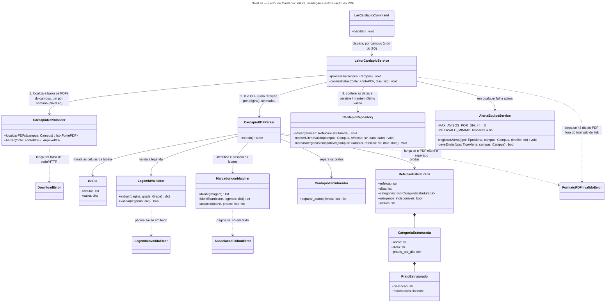
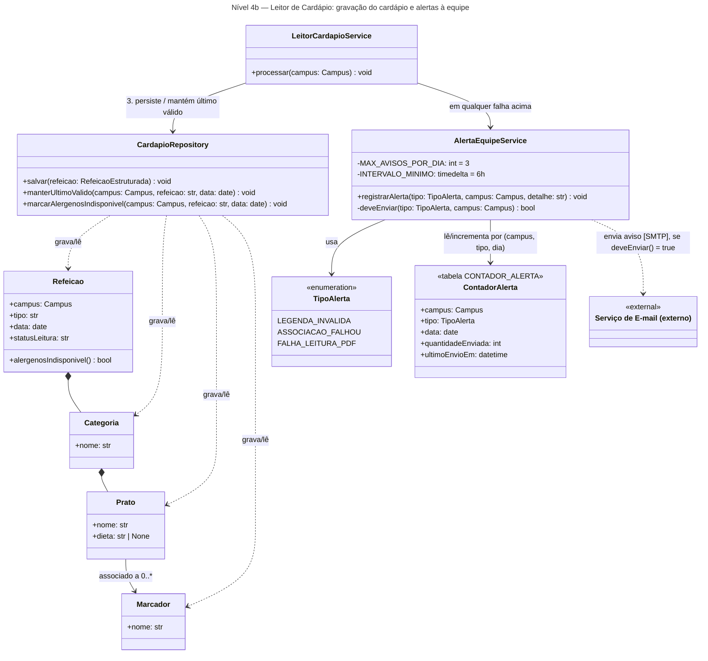
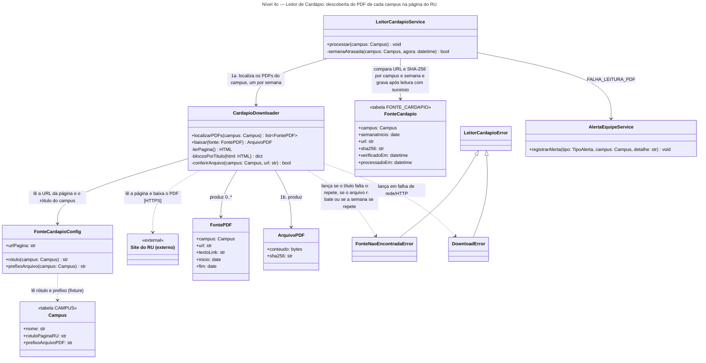

# Arquitetura C4 — Nível 4 (Leitor de Cardápio) — Bandejão

> Detalha, em diagrama de classes, o componente **Leitor de Cardápio**,
> desenhado no Nível 3 do backend dentro da fronteira do App Cardápio (ver
> `c4-nivel-3-backend.md`). Cobre a parte de leitura do Épico Cardápio
> (RF06).
>
> Referências: ADR 0003 — *Leitor de PDF como módulo do backend*
> (`docs/arquitetura/adr/0003-leitor-pdf-como-modulo-do-backend.md`), que
> define o módulo dentro do backend e o disparo por cron do SO, ADR 0006 —
> *Alerta de falha do leitor por e-mail*
> (`docs/arquitetura/adr/0006-alerta-de-falha-do-leitor-por-email.md`), e ADR
> 0014 — *Descoberta do PDF de cada campus na página de cardápios do RU*
> (`docs/arquitetura/adr/0014-descoberta-do-pdf-de-cada-campus.md`). A
> biblioteca de leitura de PDF é o `pdfplumber`, escolhido no teste com os
> PDFs reais do BE-04 (`docs/arquitetura/backend/teste-leitor-pdf-be-04.md`).

Há três diagramas: **4a** leitura do PDF, **4b** gravação e alertas e **4c** descoberta do PDF de cada campus na página do RU. Cada diagrama tem no máximo 20 elementos e um título próprio, seguindo a skill c4-architecture usada pelo grupo; classes compartilhadas (como `Conta` ou as configurações) aparecem em mais de um diagrama.

## Nível 4a — Leitura do PDF

```mermaid
---
title: "Nível 4a — Leitor de Cardápio: leitura, validação e estruturação do PDF"
---
classDiagram
  class LerCardapioCommand {
    +handle() void
  }
  class LeitorCardapioService {
    +processar(campus: Campus) void
    -conferirDatas(fonte: FontePDF, dias: list) void
  }
  class CardapioDownloader {
    +localizarPDFs(campus: Campus) list~FontePDF~
    +baixar(fonte: FontePDF) ArquivoPDF
  }
  class DownloadError
  class CardapioPDFParser {
    +extrair() tuple
  }
  class Grade {
    +celulas: list
    +caixa: dict
  }
  class FormatoPDFInvalidoError
  class LegendaValidator {
    +extrair(pagina, grade: Grade) dict
    +validar(legenda: dict) bool
  }
  class LegendaInvalidaError
  class MarcadorIconMatcher {
    +dividir(imagem) list
    +identificar(icone, legenda: dict) str
    +associar(icone, pratos: list) int
  }
  class AssociacaoFalhouError
  class CardapioEstruturador {
    +separar_pratos(linhas: list) list
  }
  class RefeicaoEstruturada {
    +refeicao: str
    +dias: list
    +categorias: list~CategoriaEstruturada~
    +alergenos_indisponiveis: bool
    +motivo: str
  }
  class CategoriaEstruturada {
    +nome: str
    +dieta: str
    +pratos_por_dia: dict
  }
  class PratoEstruturado {
    +descricao: str
    +marcadores: list~str~
  }
  class CardapioRepository {
    +salvar(refeicao: RefeicaoEstruturada) void
    +manterUltimoValido(campus: Campus, refeicao: str, data: date) void
    +marcarAlergenosIndisponivel(campus: Campus, refeicao: str, data: date) void
  }
  class AlertaEquipeService {
    +registrarAlerta(tipo: TipoAlerta, campus: Campus, detalhe: str) void
    -deveEnviar(tipo: TipoAlerta, campus: Campus) bool
    -MAX_AVISOS_POR_DIA: int = 3
    -INTERVALO_MINIMO: timedelta = 6h
  }

  LerCardapioCommand --> LeitorCardapioService : dispara, por campus (cron do SO)
  LeitorCardapioService --> CardapioDownloader : 1. localiza e baixa os PDFs do campus, um por semana (Nível 4c)
  LeitorCardapioService --> CardapioPDFParser : 2. lê o PDF (uma refeição por página), se mudou
  CardapioPDFParser --> Grade : monta as células da tabela
  CardapioPDFParser --> LegendaValidator : valida a legenda
  CardapioPDFParser --> MarcadorIconMatcher : identifica e associa os ícones
  CardapioPDFParser --> CardapioEstruturador : separa os pratos
  CardapioPDFParser --> RefeicaoEstruturada : produz
  LeitorCardapioService --> CardapioRepository : 3. confere as datas e persiste / mantém último válido
  LeitorCardapioService --> AlertaEquipeService : em qualquer falha acima
  CardapioDownloader ..> DownloadError : lança em falha de rede/HTTP
  LeitorCardapioService ..> FormatoPDFInvalidoError : lança se há dia do PDF fora do intervalo do link
  CardapioPDFParser ..> FormatoPDFInvalidoError : lança se o PDF não é o esperado
  LegendaValidator ..> LegendaInvalidaError : página sai só em texto
  MarcadorIconMatcher ..> AssociacaoFalhouError : página sai só em texto
  RefeicaoEstruturada *-- CategoriaEstruturada
  CategoriaEstruturada *-- PratoEstruturado
```

### Notas do diagrama (4a)

- **`LeitorCardapioService` é o orquestrador único**, chamado pelo comando
  de management do Django (`LerCardapioCommand`) que o cron do SO dispara —
  o cron em si segue fora do diagrama, como já registrado no Nível 2. Um
  orquestrador central facilita isolar, em testes, cada etapa (download,
  parsing, validação, associação, estruturação, persistência) separadamente,
  o que ajuda a bater as metas de cobertura (≥ 70%) e de mutação (≥ 50%) dos
  módulos críticos (RNF06, ADR 0013).
- **O PDF é processado só quando mudou.** O `CardapioDownloader` acha os
  links do campus na página do RU, um por semana, e baixa cada arquivo
  (Nível 4c). Se a URL e o SHA-256 forem iguais aos da última leitura com
  sucesso daquele campus e daquela semana (`FonteCardapio`), o
  `LeitorCardapioService` para ali, sem ler o PDF nem gravar nada. Leitura
  com sucesso é a que grava a semana, mesmo com alguma refeição só em texto
  (RF06.3). Assim o cron pode rodar de 3 em 3 horas (ADR 0014) sem
  regravar o cardápio, e uma correção feita pelo RU no meio da semana é
  lida na execução seguinte.
- **`conferirDatas` confere que todos os dias que o `CardapioPDFParser` leu
  no cabeçalho do PDF estão dentro do intervalo do texto do link**
  ("09/11/2026 À 15/11/2026"). Não exige igualdade, porque o PDF traz só os
  dias em que o campus serve refeição (o Gama tem 5 ou 6, RF06.2). Se algum
  dia ficar fora, o PDF é tratado como `FormatoPDFInvalidoError`: o último
  cardápio válido é mantido e a equipe é alertada (ADR 0014).
- **Cinco exceções específicas, uma por tipo de falha**, todas filhas de
  `LeitorCardapioError`: `FonteNaoEncontradaError` (Nível 4c),
  `DownloadError` (BE-12) e `FormatoPDFInvalidoError` mantêm o último
  cardápio válido; `LegendaInvalidaError` e
  `AssociacaoFalhouError` são tratadas pelo `CardapioPDFParser` **por
  página**: a refeição sai só em texto, com `alergenos_indisponiveis` e o
  motivo, e o filtro (RF08) fica desativado só para ela. As três primeiras
  geram alerta `FALHA_LEITURA_PDF`, com uma mensagem que diz qual etapa
  falhou; as duas últimas geram `LEGENDA_INVALIDA` e `ASSOCIACAO_FALHOU`.
  Detalhes no teste do BE-04
  (`teste-leitor-pdf-be-04.md`).
- **Diagrama atualizado no BE-04**: a proposta inicial tinha uma
  `PaginaExtraida` e um `CardapioEstruturador.estruturar()`. Na
  implementação, o `CardapioPDFParser` monta a refeição com a `Grade` e as
  outras classes, e o `MarcadorIconMatcher` associa um ícone por vez.
- **`CardapioEstruturador.separar_pratos` existe como método próprio** porque
  a regra "ou/OU separa pratos; / não separa" (glossário, Termo Prato) é uma
  regra de negócio testável isoladamente, sem precisar de um PDF real —
  boa candidata a teste unitário dedicado.
- **`MarcadorIconMatcher` funciona por posição**, não por texto, porque o
  RF06 é explícito: os ícones dos marcadores são imagens sobrepostas ao
  texto do PDF, fora da camada de texto extraível. Essa é provavelmente a
  classe de maior risco técnico do módulo (L03) e a que mais provavelmente
  muda de implementação dependendo da biblioteca de leitura de PDF adotada.
  No teste do BE-04 com o `pdfplumber`, ela identificou cada ícone
  comparando a imagem com as da legenda e associou todos os ícones dos PDFs
  do Gama, da Ceilândia e do Darcy Ribeiro.

## Nível 4b — Gravação e alertas

```mermaid
---
title: "Nível 4b — Leitor de Cardápio: gravação do cardápio e alertas à equipe"
---
classDiagram
  class LeitorCardapioService {
    +processar(campus: Campus) void
  }
  class CardapioRepository {
    +salvar(refeicao: RefeicaoEstruturada) void
    +manterUltimoValido(campus: Campus, refeicao: str, data: date) void
    +marcarAlergenosIndisponivel(campus: Campus, refeicao: str, data: date) void
  }
  class Refeicao {
    +campus: Campus
    +tipo: str
    +data: date
    +statusLeitura: str
    +alergenosIndisponivel() bool
  }
  class Categoria {
    +nome: str
  }
  class Prato {
    +nome: str
    +dieta: str | None
  }
  class Marcador {
    +nome: str
  }
  class AlertaEquipeService {
    +registrarAlerta(tipo: TipoAlerta, campus: Campus, detalhe: str) void
    -deveEnviar(tipo: TipoAlerta, campus: Campus) bool
    -MAX_AVISOS_POR_DIA: int = 3
    -INTERVALO_MINIMO: timedelta = 6h
  }
  class TipoAlerta {
    <<enumeration>>
    LEGENDA_INVALIDA
    ASSOCIACAO_FALHOU
    FALHA_LEITURA_PDF
  }
  class ContadorAlerta {
    <<tabela CONTADOR_ALERTA>>
    +campus: Campus
    +tipo: TipoAlerta
    +data: date
    +quantidadeEnviada: int
    +ultimoEnvioEm: datetime
  }
  class EmailSvc["Serviço de E-mail (externo)"] {
    <<external>>
  }

  LeitorCardapioService --> CardapioRepository : 3. persiste / mantém último válido
  LeitorCardapioService --> AlertaEquipeService : em qualquer falha acima
  AlertaEquipeService --> TipoAlerta : usa
  AlertaEquipeService --> ContadorAlerta : lê/incrementa por (campus, tipo, dia)
  AlertaEquipeService ..> EmailSvc : envia aviso [SMTP], se deveEnviar() = true
  CardapioRepository ..> Refeicao : grava/lê
  CardapioRepository ..> Categoria : grava/lê
  CardapioRepository ..> Prato : grava/lê
  CardapioRepository ..> Marcador : grava/lê
  Refeicao *-- Categoria
  Categoria *-- Prato
  Prato --> Marcador : associado a 0..*
```

### Notas do diagrama (4b)

- **`AlertaEquipeService` limita a no máximo 3 avisos por dia, por
  combinação de campus + tipo de falha**, controlado por `ContadorAlerta`
  (campus, tipo, dia, quantidade já enviada, horário do último envio).
  `deveEnviar()` também impõe um intervalo mínimo de 6 horas entre avisos
  repetidos da mesma falha, para espalhar os 3 avisos ao longo do dia em vez
  de disparar todos de uma vez se o cron rodar mais de uma vez por dia. O
  contador zera quando a leitura daquele campus volta a funcionar (ou, no
  mais tardar, no dia seguinte) — assim, uma falha de vários dias seguidos
  continua gerando pelo menos 1 aviso por dia, em vez de ficar em silêncio
  total depois do 3º e-mail. Decisão registrada na ADR 0006
  (`docs/arquitetura/adr/0006-alerta-de-falha-do-leitor-por-email.md`), que compara o
  e-mail com log passivo e consulta manual ao banco. O e-mail de destino
  desses avisos é `equipe@bandejaounb.com.br`, configurável por variável de
  ambiente (ADR 0012).
- **`Refeicao`, `Categoria`, `Prato` e `Marcador` são os models Django do
  app Cardápio** (não deste módulo) — aparecem aqui só como o destino da
  persistência do `CardapioRepository`, para deixar explícito o que o Leitor
  de Cardápio grava, sem redefinir o schema completo do app.
- **`Categoria` e `Prato` seguem o dicionário de dados do Nível 4 do banco**
  (seguido pelos models no PR #108): a dieta fica em `Prato.dieta`, nula nas
  categorias comuns a todas as dietas (RF09), e o texto do prato fica em
  `Prato.nome`. O parser continua devolvendo a dieta por categoria
  (`CategoriaEstruturada.dieta`, Nível 4a) e o texto em
  `PratoEstruturado.descricao`. Ao gravar, o `CardapioRepository` copia a
  dieta da categoria para cada prato dela (ver a seção 6 do teste do BE-04)
  e grava `descricao` em `Prato.nome`. Assim, todos os pratos de uma
  categoria têm a mesma dieta, e a Exposição do Cardápio conta com isso no
  `FiltroDietaService`.
- **`Refeicao.statusLeitura` é a coluna `REFEICAO.status_leitura` do banco**
  (`ok`, `alergenos_indisponiveis` ou `leitura_falhou`).
  `CardapioRepository.marcarAlergenosIndisponivel` grava
  `alergenos_indisponiveis`, e `alergenosIndisponivel()` é uma propriedade
  derivada do model, verdadeira nesse caso; ela não é coluna. É a mesma
  propriedade lida pela Exposição do Cardápio para desativar o filtro de
  marcadores (RF08). Decisão tomada com o time de banco de dados.
- **Cada alerta é gravado em `ALERTA_LEITURA_CARDAPIO`** por
  `registrarAlerta`, para a equipe tratar (campo `resolvido`, ADR 0004), e o
  limite de e-mails é controlado pela tabela `CONTADOR_ALERTA`, que é o
  `ContadorAlerta` deste diagrama (uma linha por campus, tipo e dia). No
  banco, os valores de `TipoAlerta` ficam em minúsculas:
  `legenda_invalida`, `associacao_falhou` e `falha_leitura_pdf`. Ver o Nível 4
  do banco de dados.

## Nível 4c — Descoberta do PDF de cada campus

```mermaid
---
title: "Nível 4c — Leitor de Cardápio: descoberta do PDF de cada campus na página do RU"
---
classDiagram
  class LeitorCardapioService {
    +processar(campus: Campus) void
    -semanaAtrasada(campus: Campus, agora: datetime) bool
  }
  class CardapioDownloader {
    +localizarPDFs(campus: Campus) list~FontePDF~
    +baixar(fonte: FontePDF) ArquivoPDF
    -lerPagina() HTML
    -blocosPorTitulo(html: HTML) dict
    -conferirArquivo(campus: Campus, url: str) bool
  }
  class FonteCardapioConfig {
    +urlPagina: str
    +rotulo(campus: Campus) str
    +prefixoArquivo(campus: Campus) str
  }
  class Campus {
    <<tabela CAMPUS>>
    +nome: str
    +rotuloPaginaRU: str
    +prefixoArquivoPDF: str
  }
  class FontePDF {
    +campus: Campus
    +url: str
    +textoLink: str
    +inicio: date
    +fim: date
  }
  class ArquivoPDF {
    +conteudo: bytes
    +sha256: str
  }
  class FonteCardapio {
    <<tabela FONTE_CARDAPIO>>
    +campus: Campus
    +semanaInicio: date
    +url: str
    +sha256: str
    +verificadoEm: datetime
    +processadoEm: datetime
  }
  class LeitorCardapioError
  class FonteNaoEncontradaError
  class DownloadError
  class AlertaEquipeService {
    +registrarAlerta(tipo: TipoAlerta, campus: Campus, detalhe: str) void
  }
  class SiteRU["Site do RU (externo)"] {
    <<external>>
  }

  LeitorCardapioService --> CardapioDownloader : 1a. localiza os PDFs do campus, um por semana
  CardapioDownloader --> FonteCardapioConfig : lê a URL da página e o rótulo do campus
  FonteCardapioConfig ..> Campus : lê rótulo e prefixo (fixture)
  CardapioDownloader ..> SiteRU : lê a página e baixa o PDF [HTTPS]
  CardapioDownloader --> FontePDF : produz 0..*
  CardapioDownloader --> ArquivoPDF : 1b. produz
  LeitorCardapioService --> FonteCardapio : compara URL e SHA-256 por campus e semana e grava após leitura com sucesso
  LeitorCardapioService --> AlertaEquipeService : FALHA_LEITURA_PDF
  CardapioDownloader ..> FonteNaoEncontradaError : lança se o título falta ou se repete, se o arquivo não bate ou se a semana se repete
  CardapioDownloader ..> DownloadError : lança em falha de rede/HTTP
  LeitorCardapioError <|-- FonteNaoEncontradaError
  LeitorCardapioError <|-- DownloadError
```

### Notas do diagrama (4c)

- **O campus vem do nome no título, nunca da ordem dos blocos.**
  `blocosPorTitulo` percorre a página e, para cada título "Cardápio
  <rótulo>", guarda todos os links para `.pdf` em
  `ru.unb.br/wp-content/uploads/` que aparecem depois dele e antes do próximo
  título. O resultado é um dicionário rótulo → links, consultado pelo rótulo
  do campus. Cada link vira uma `FontePDF`, identificada pela semana das
  datas do texto do link. Assim a semana vigente e a seguinte (RF18) podem
  estar no mesmo bloco. Dois links para a mesma semana geram
  `FonteNaoEncontradaError` para aquela semana. A posição dos blocos na página (hoje Darcy Ribeiro, Ceilândia,
  Gama, Planaltina e Fazenda Água Limpa) não é usada, porque o RU não
  garante essa ordem (ADR 0014).
- **A comparação dos títulos ignora acentos, maiúsculas e espaços extras.**
  Um título que não corresponde a nenhum campus é ignorado. Um campus sem
  título, ou com o título repetido, gera `FonteNaoEncontradaError`, e o
  Leitor não escolhe um dos links.
- **`conferirArquivo` confere o nome do arquivo:** ele precisa começar pelo
  `prefixoArquivoPDF` do campus (`Darcy-Ribeiro`, `Ceilandia`, `Gama`,
  `Planaltina`, `Fazenda`), sem considerar os sufixos `-1`, `-2` que o
  WordPress acrescenta quando o RU reenvia o arquivo. Se não bater, também é
  `FonteNaoEncontradaError`: um link colado no bloco errado pelo RU não vira
  o cardápio de outro campus.
- **`FontePDF` guarda as datas do texto do link** ("ISM – 09/11/2026 À
  15/11/2026"). O `inicio` identifica a semana, e o
  `LeitorCardapioService.conferirDatas` confere depois que os dias do PDF
  estão dentro do intervalo (Nível 4a).
- **Semana ainda não publicada não é falha.** Se o link ainda é da semana
  anterior, nada muda e a Exposição do Cardápio mostra "cardápio ainda não
  publicado" (RF07.3). `semanaAtrasada` devolve verdadeiro quando a semana
  vigente ainda não tem `FonteCardapio` daquele campus depois do prazo do
  Anexo A (segunda-feira, 12h, no horário de Brasília); aí a equipe recebe um
  alerta `FALHA_LEITURA_PDF`.
- **`FonteCardapioConfig` segue o padrão de `LocalizacaoRUConfig`** (Fila):
  a URL da página vem da configuração do Django (Anexo A), e o rótulo e o
  prefixo de cada campus vêm das colunas de `CAMPUS`, povoadas por fixture.
  Se o RU renomear um título, o ajuste é na fixture, sem mudar o código.
- **`FonteCardapio` é a tabela `FONTE_CARDAPIO`**, com uma linha por campus
  e semana.
  `verificadoEm` é atualizado a cada execução que acha o link;
  `url`, `sha256` e `processadoEm` só depois de uma leitura com sucesso, para
  que um PDF com falha seja tentado de novo na execução seguinte. Ver o
  Nível 4 do banco de dados.
- **A biblioteca de HTML é o `beautifulsoup4`**, com o `requests` para as
  requisições HTTPS. As requisições levam `User-Agent` do projeto e tempo
  limite.

## Notas gerais

- Este diagrama é uma **proposta de decomposição interna**, não uma
  decisão de arquitetura registrada — se a dupla responsável pela leitura do
  PDF adotar um desenho de classes diferente ao implementar, vale atualizar
  este arquivo (ou registrar o desenho final como ADR, se a mudança for
  relevante o suficiente).
