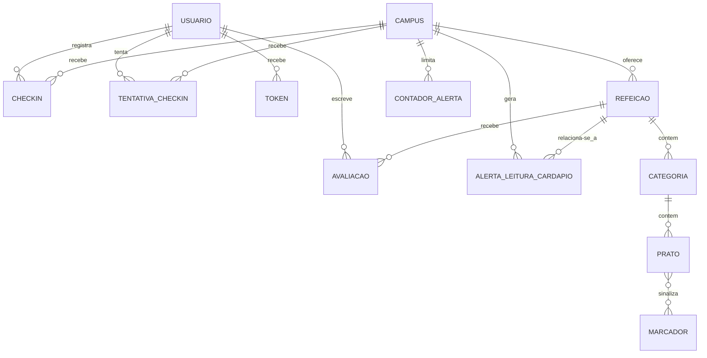
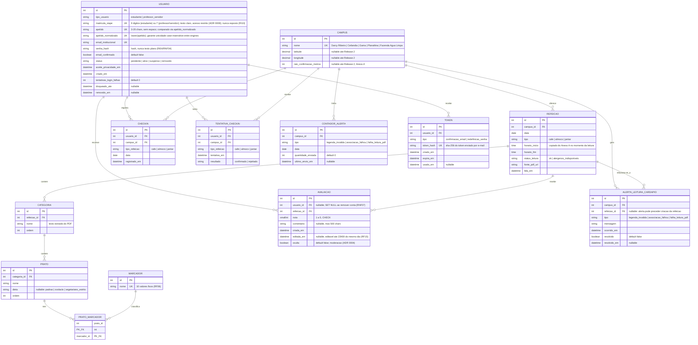

# Arquitetura C4 — Níveis 3 e 4 — Banco de Dados — Bandejão

> Fontes: glossário do domínio (`docs/requisitos/CONTEXT-DOMINIO.md`),
> Documento de Requisitos de Software (RF01–RF18, RNF01–RNF08, RI01–RI10,
> Anexo A), ADR 0001 (stack de backend), ADR 0002 (matrícula/apelido
> extraídos do e-mail), ADR 0004 (moderação por acesso direto ao banco),
> ADR 0006 (alerta do leitor), ADR 0007 (sessão por cookie) e ADR 0008
> (matrícula/SIAPE em texto claro). Nomes de
> entidades seguem o vocabulário canônico do glossário — não os nomes usados
> no rascunho da issue (#32): "Cardápio" não existe como entidade única, pois
> o glossário já decompõe esse conceito em Refeição → Categoria → Prato;
> "Relato" foi mapeado para `AlertaLeituraCardapio`, a estrutura que registra
> os alertas de leitura de PDF previstos em RF06.

---

## Nível 3 — Diagrama de Componentes (entidades e relacionamentos)

### Notas do diagrama (Nível 3)

- **`USUARIO` é a conta**, não a pessoa (glossário: "Usuário"). Uma pessoa com
  matrícula e SIAPE pode gerar duas linhas de `USUARIO`.
- **Não existe uma entidade `Cardapio`.** O cardápio de uma refeição é a
  composição `REFEICAO → CATEGORIA → PRATO (→ MARCADOR)`; isso é decisão de
  modelagem, não uma omissão — reflete a própria estrutura hierárquica exigida
  por RF07 ("categorias em lista hierarquizada").
- **`PRATO` não é avaliado individualmente.** A avaliação (RF15) é sempre por
  `REFEICAO` inteira; por isso `AVALIACAO` se relaciona a `REFEICAO`, não a
  `PRATO`. `PRATO` só existe para exibição e para os filtros (RF08, RF09).
- **`CHECKIN` e `TENTATIVA_CHECKIN` (Épico Fila) e `ALERTA_LEITURA_CARDAPIO`
  e `CONTADOR_ALERTA` (módulo Leitor de Cardápio, ADRs 0003 e 0006)** fazem
  parte do modelo da Release 2. O protótipo da Release 1 não tem banco.
- **`CHECKIN` não aponta para `REFEICAO`**: guarda campus, tipo de refeição e
  data. Assim o check-in e a previsão de pico continuam funcionando mesmo
  que a leitura do PDF falhe naquela semana (ver C4 Nível 4 da Fila).
  `CHECKIN` guarda só os check-ins confirmados; `TENTATIVA_CHECKIN` guarda
  cada conferência de localização, confirmada ou rejeitada (RF12).
- **`TOKEN` generaliza os links de uso único** de confirmação de e-mail (RF02)
  e de redefinição de senha (RF04): mesma estrutura, campo `tipo` diferencia o
  uso. Ver Nível 4 para os campos.
- **`MARCADOR` é tabela de apoio (lookup) com exatamente 10 linhas fixas**
  (RF06: "a legenda do arquivo contém exatamente os 10 marcadores
  conhecidos"), povoada por uma migration de dados (fixture), não pelo
  usuário final nem pela leitura do PDF.

---

---

## Nível 4 — Diagrama Entidade-Relacionamento completo

---

## Dicionário de dados

Tipos expressos como tipo lógico do Django (portátil entre SQLite e MySQL,
ver [Estratégia de migração](#estratégia-de-migração-sqlite--mysql)), não como
tipo físico de um banco específico.

### `USUARIO`

| Campo | Tipo | Constraints | Descrição |
|---|---|---|---|
| `id` | AutoField | PK | Identificador interno da conta. |
| `tipo_usuario` | CharField(20) | NOT NULL, choices | `estudante` ou `professor_servidor` (ADR 0002; "Professor" e "Servidor" da tela de cadastro colapsam neste único valor). |
| `matricula_siape` | CharField(9) | NOT NULL, **UNIQUE**, index | 9 dígitos (estudante, extraída do e-mail) ou 7 dígitos (professor/servidor, digitada). Armazenada em texto claro, com acesso ao banco restrito à equipe (ADR 0008), para permitir a busca no login e a recuperação a partir do apelido (RNF07). Dado privado (RI10): nunca retornado em resposta de API pública nem gravado em log. |
| `apelido` | CharField(20) | NOT NULL, 3–20 chars, sem espaço | Nome público exibido nas avaliações. Definido uma única vez no cadastro (RF01); imutável depois. |
| `apelido_normalizado` | CharField(20) | NOT NULL, **UNIQUE** | `lower(apelido)`, gerado na gravação. Garante a unicidade *case-insensitive* exigida por RF01 de forma idêntica em SQLite e MySQL (ver seção de migração). |
| `email_institucional` | EmailField | NOT NULL, **UNIQUE** | `matricula@aluno.unb.br` (estudante) ou `nome@unb.br` (professor/servidor). Único canal de confirmação e recuperação (RF02, RF04, L07). |
| `senha_hash` | CharField(128) | NOT NULL | Hash da senha (Django `PBKDF2`/`Argon2`); nunca texto plano (RI04, RNF04). |
| `email_confirmado` | BooleanField | NOT NULL, default `false` | Conta só autentica com `true` (RF02, RF03). |
| `status` | CharField(20) | NOT NULL, choices, default `pendente` | `pendente` \| `ativo` \| `suspenso` \| `removido` (RNF08 — moderação manual da equipe, ADR 0004). Contas `suspenso` e `removido` não se autenticam, e as sessões abertas deixam de valer (ADR 0007). As avaliações de conta `suspenso` continuam visíveis, a menos que sejam ocultadas uma a uma (`AVALIACAO.oculta`). |
| `aceite_privacidade_em` | DateTimeField | NOT NULL | Momento em que a pessoa confirmou ciência do aviso de privacidade (RF01); cadastro não se conclui sem isso. |
| `criado_em` | DateTimeField | NOT NULL, auto | Data do cadastro. |
| `tentativas_login_falhas` | IntegerField | NOT NULL, default `0` | Contador para o bloqueio de login (RF03, Anexo A: 5 tentativas/10 min). Zerado a cada login bem-sucedido ou a cada nova janela de 10 min. |
| `bloqueado_ate` | DateTimeField | nullable | Fim do bloqueio de 10 minutos (RF03), quando aplicável. |
| `removido_em` | DateTimeField | nullable | Preenchido quando a equipe processa uma exclusão de conta (RNF07); a partir daqui as avaliações do usuário passam a ser exibidas como "usuário removido" (ver `AVALIACAO.usuario_id`). |

### `CAMPUS`

| Campo | Tipo | Constraints | Descrição |
|---|---|---|---|
| `id` | AutoField | PK | — |
| `nome` | CharField(50) | NOT NULL, **UNIQUE** | Um dos 5 campi com RU (glossário): Darcy Ribeiro, Ceilândia, Gama, Planaltina, Fazenda Água Limpa. Povoado por fixture; não é criado pelo usuário. |
| `latitude` / `longitude` | DecimalField | nullable | Coordenadas do RU, usadas apenas na conferência de GPS do check-in (RF12); "a definir pela equipe" (Anexo A) — por isso nullable até a Release 2. O raio do Darcy Ribeiro deve excluir o Restaurante Executivo. |
| `raio_confirmacao_metros` | IntegerField | nullable | Raio de confirmação do check-in por GPS (Anexo A, RF12). |

### `REFEICAO`

| Campo | Tipo | Constraints | Descrição |
|---|---|---|---|
| `id` | AutoField | PK | — |
| `campus_id` | ForeignKey → `CAMPUS` | NOT NULL, `ON DELETE PROTECT` | — |
| `data` | DateField | NOT NULL | Dia do serviço, conforme datas do PDF (RF07). |
| `tipo` | CharField(10) | NOT NULL, choices | `cafe` \| `almoco` \| `jantar`. |
| `horario_inicio` / `horario_fim` | TimeField | NOT NULL | Copiados do parâmetro configurável (Anexo A) no momento da leitura do PDF; usados para liberar avaliação (RF15) e check-in (RF11) apenas durante a janela. |
| `status_leitura` | CharField(30) | NOT NULL, choices, default `ok` | `ok` \| `alergenos_indisponiveis` (RF06: legenda inválida ou associação de ícone falhou). Não existe estado de "leitura falhou": quando a leitura do PDF falha, as refeições já gravadas não são alteradas (o último cardápio válido continua valendo) e a falha fica registrada em `ALERTA_LEITURA_CARDAPIO`. |
| `fonte_pdf_url` | URLField | NOT NULL | PDF de origem, para rastreabilidade da leitura (RF06). |
| `lida_em` | DateTimeField | NOT NULL, auto | Quando a leitura automatizada gravou/atualizou esta refeição. |
| — | — | **UNIQUE** (`campus_id`, `data`, `tipo`) | Não existem duas refeições do mesmo tipo, no mesmo campus, no mesmo dia. |

### `CATEGORIA`

| Campo | Tipo | Constraints | Descrição |
|---|---|---|---|
| `id` | AutoField | PK | — |
| `refeicao_id` | ForeignKey → `REFEICAO` | NOT NULL, `ON DELETE CASCADE` | — |
| `nome` | CharField(100) | NOT NULL | Texto extraído do PDF (ex.: "Bebidas", "Guarnição", "Sopa", "Prato principal ovolactovegetariano"). |
| `ordem` | IntegerField | NOT NULL | Posição de exibição, refletindo a ordem do PDF (RF07: "lista hierarquizada"). |

### `PRATO`

| Campo | Tipo | Constraints | Descrição |
|---|---|---|---|
| `id` | AutoField | PK | — |
| `categoria_id` | ForeignKey → `CATEGORIA` | NOT NULL, `ON DELETE CASCADE` | — |
| `nome` | CharField(200) | NOT NULL | Uma opção dentro da categoria; "ou/OU" separa pratos distintos, "/" não separa (glossário). |
| `dieta` | CharField(20) | nullable, choices | `padrao` \| `ovolacto` \| `vegetariano_estrito`, preenchido só quando a categoria é uma linha de prato principal (almoço/jantar) ou de complemento (café da manhã); `NULL` para categorias comuns a todas as dietas (saladas, guarnição, sopa etc. — RF09). |
| `ordem` | IntegerField | NOT NULL | Posição dentro da categoria. |

### `MARCADOR`

| Campo | Tipo | Constraints | Descrição |
|---|---|---|---|
| `id` | AutoField | PK | — |
| `nome` | CharField(30) | NOT NULL, **UNIQUE** | Um dos 10 valores fixos do glossário: cogumelo, leite_e_derivados, mel, pimenta, soja, trigo_gluten, amendoim, oleaginosa, ovo, suino. Povoado por fixture/migration de dados; RF06 valida que a legenda do PDF contém exatamente estes 10. |

### `PRATO_MARCADOR` (associativa)

| Campo | Tipo | Constraints | Descrição |
|---|---|---|---|
| `prato_id` | ForeignKey → `PRATO` | PK composta, `ON DELETE CASCADE` | — |
| `marcador_id` | ForeignKey → `MARCADOR` | PK composta, `ON DELETE PROTECT` | Marcadores não são removidos enquanto houver prato associado. |

### `AVALIACAO`

| Campo | Tipo | Constraints | Descrição |
|---|---|---|---|
| `id` | AutoField | PK | — |
| `usuario_id` | ForeignKey → `USUARIO` | **nullable**, `ON DELETE SET NULL` | Ao excluir a conta, a avaliação permanece, mas passa a ser exibida como "usuário removido" (RNF07), em vez de ser apagada. |
| `refeicao_id` | ForeignKey → `REFEICAO` | NOT NULL, `ON DELETE CASCADE` | A avaliação é da refeição inteira (campus + dia + tipo), nunca de um prato (RF15). |
| `nota` | SmallIntegerField | NOT NULL, **CHECK** `1 <= nota <= 5` | Obrigatória (RF15). |
| `comentario` | TextField | nullable, **CHECK** `length(comentario) <= 500` | Opcional (RF15); sanitizado contra XSS na camada de aplicação (RNF04). |
| `criada_em` | DateTimeField | NOT NULL, auto | — |
| `editada_em` | DateTimeField | nullable | Preenchido a cada edição; a janela de edição (até 23h59 do mesmo dia) é validada na aplicação, não no banco. |
| `oculta` | BooleanField | NOT NULL, default `false` | Marcada pela equipe por acesso direto ao banco (moderação, ADR 0004, RNF08). Avaliação oculta não é retornada pela API pública e não entra na média nem na contagem (RF15). |
| — | — | **UNIQUE** (`usuario_id`, `refeicao_id`) | No máximo uma avaliação por usuário por refeição (RF15); uma segunda tentativa é tratada como `UPDATE`, não `INSERT`. |

### `CHECKIN` (Release 2)

| Campo | Tipo | Constraints | Descrição |
|---|---|---|---|
| `id` | AutoField | PK | — |
| `usuario_id` | ForeignKey → `USUARIO` | NOT NULL, `ON DELETE CASCADE` | — |
| `campus_id` | ForeignKey → `CAMPUS` | NOT NULL, `ON DELETE PROTECT` | RU onde o check-in foi feito. |
| `tipo_refeicao` | CharField(10) | NOT NULL, choices | `cafe` \| `almoco` \| `jantar`. |
| `data` | DateField | NOT NULL | Dia do check-in (horário de Brasília). |
| `registrado_em` | DateTimeField | NOT NULL, auto | Instante do check-in; é o que define a faixa de horário na previsão de pico (RF13). |
| — | — | **UNIQUE** (`usuario_id`, `campus_id`, `tipo_refeicao`, `data`) | No máximo um check-in por usuário por refeição por dia (RF11, RI03), inclusive com requisições simultâneas (toque duplo). |

Guarda **só check-ins confirmados** e **não tem FK para `REFEICAO`**, para não depender da leitura do PDF. A recusa de check-in em refeição que o cardápio publicado não lista (RF11) é feita na aplicação, consultando `REFEICAO` apenas quando existe cardápio publicado para a semana.

### `TENTATIVA_CHECKIN` (Release 2)

| Campo | Tipo | Constraints | Descrição |
|---|---|---|---|
| `id` | AutoField | PK | — |
| `usuario_id` | ForeignKey → `USUARIO` | NOT NULL, `ON DELETE CASCADE` | — |
| `campus_id` | ForeignKey → `CAMPUS` | NOT NULL, `ON DELETE PROTECT` | — |
| `tipo_refeicao` | CharField(10) | NOT NULL, choices | `cafe` \| `almoco` \| `jantar`. |
| `tentativa_em` | DateTimeField | NOT NULL, auto | — |
| `resultado` | CharField(10) | NOT NULL, choices | `confirmado` \| `rejeitado` (fora do raio de GPS). |

Registra **cada conferência de localização** (RF12). Tentativas recusadas antes dessa etapa (fora do horário, check-in já feito, refeição não servida) não geram linha. Nenhuma tabela tem coluna de coordenadas do usuário (RI09).

### `ALERTA_LEITURA_CARDAPIO`

| Campo | Tipo | Constraints | Descrição |
|---|---|---|---|
| `id` | AutoField | PK | — |
| `campus_id` | ForeignKey → `CAMPUS` | NOT NULL, `ON DELETE CASCADE` | — |
| `refeicao_id` | ForeignKey → `REFEICAO` | nullable, `ON DELETE SET NULL` | Nulo quando o alerta é sobre a leitura do PDF como um todo, antes de qualquer refeição ser criada/atualizada (RF06). |
| `tipo` | CharField(30) | NOT NULL, choices | `legenda_invalida` \| `associacao_falhou` \| `falha_leitura_pdf` (mesmos valores de `TipoAlerta` no C4 Nível 4 do Leitor de Cardápio). |
| `mensagem` | TextField | NOT NULL | Detalhe técnico do alerta, para a equipe (RF06, módulo Leitor de Cardápio — ADR 0003). |
| `ocorrido_em` | DateTimeField | NOT NULL, auto | — |
| `resolvido` | BooleanField | NOT NULL, default `false` | Marcado manualmente pela equipe (RNF08: sem tela administrativa no escopo — atualização provavelmente via acesso direto ao banco, ADR 0004). |
| `resolvido_em` | DateTimeField | nullable | — |

### `CONTADOR_ALERTA`

| Campo | Tipo | Constraints | Descrição |
|---|---|---|---|
| `id` | AutoField | PK | — |
| `campus_id` | ForeignKey → `CAMPUS` | NOT NULL, `ON DELETE CASCADE` | — |
| `tipo` | CharField(30) | NOT NULL, choices | Mesmos valores de `ALERTA_LEITURA_CARDAPIO.tipo`. |
| `data` | DateField | NOT NULL | Dia da contagem. |
| `quantidade_enviada` | IntegerField | NOT NULL, default `0` | E-mails de alerta já enviados à equipe nesse dia para essa combinação. |
| `ultimo_envio_em` | DateTimeField | nullable | Usado para o intervalo mínimo de 6 horas entre avisos. |
| — | — | **UNIQUE** (`campus_id`, `tipo`, `data`) | Uma contagem por campus, tipo de falha e dia. |

Controla só o **limite de e-mails** (no máximo 3 por dia, intervalo de 6 horas — ADR 0006). O **histórico** das falhas fica em `ALERTA_LEITURA_CARDAPIO`, que recebe uma linha a cada falha, com ou sem e-mail enviado.

### `TOKEN`

| Campo | Tipo | Constraints | Descrição |
|---|---|---|---|
| `id` | AutoField | PK | — |
| `usuario_id` | ForeignKey → `USUARIO` | NOT NULL, `ON DELETE CASCADE` | — |
| `tipo` | CharField(20) | NOT NULL, choices | `confirmacao_email` (RF02) \| `redefinicao_senha` (RF04). |
| `token_hash` | CharField(64) | NOT NULL, **UNIQUE** | SHA-256 do token enviado por e-mail; o token em si nunca é persistido em claro (RNF04: "token aleatório imprevisível"). |
| `criado_em` | DateTimeField | NOT NULL, auto | Usado também para aplicar os limites do Anexo A por matrícula/SIAPE: 3 solicitações de redefinição por hora (RF04, linhas com `tipo = redefinicao_senha`) e 3 reenvios de confirmação por hora (RF02, linhas com `tipo = confirmacao_email`). |
| `expira_em` | DateTimeField | NOT NULL | `criado_em` + 24h (confirmação) ou + 1h (redefinição), conforme Anexo A. |
| `usado_em` | DateTimeField | nullable | Preenchido no uso; um token com `usado_em` preenchido ou `expira_em` no passado é inválido (validado na aplicação). |

---

## Constraints principais

Nem toda regra do Documento de Requisitos vira uma constraint de banco —
algumas exigem lógica (data corrente, janelas de horário, contagem em
período) e ficam na camada de aplicação (Django). A tabela abaixo separa as
duas categorias.

| Regra | Origem | Onde é aplicada |
|---|---|---|
| Uma avaliação por usuário por refeição (segunda tentativa vira edição) | RF15 | **Banco**: `UNIQUE (usuario_id, refeicao_id)` em `AVALIACAO`. |
| Nota entre 1 e 5 | RF15 | **Banco**: `CHECK` em `AVALIACAO.nota`. |
| Comentário com no máximo 500 caracteres | RF15 | **Banco**: `CHECK` de tamanho + `max_length` no Serializer (DRF valida antes de chegar ao banco). |
| Matrícula/SIAPE pertence a uma única conta | RF01 | **Banco**: `UNIQUE` em `USUARIO.matricula_siape`. |
| E-mail institucional único | RF01 | **Banco**: `UNIQUE` em `USUARIO.email_institucional`. |
| Apelido único, sem distinção de maiúsculas/minúsculas, 3–20 chars, sem espaço | RF01 | **Banco**: `UNIQUE` em `USUARIO.apelido_normalizado` (case garantida pela normalização — ver migração). **Aplicação**: comprimento e ausência de espaço (`CHECK`/validação no Serializer). |
| Apelido imutável após o cadastro | RF01 | **Aplicação**: campo não exposto em `PATCH/PUT` do Serializer; não é uma constraint de banco expressável diretamente. |
| Um check-in por usuário por refeição por dia (RI03), inclusive com requisições simultâneas | RF11, RI03 | **Banco**: `UNIQUE (usuario_id, campus_id, tipo_refeicao, data)` em `CHECKIN`. Como as tentativas rejeitadas ficam em outra tabela (`TENTATIVA_CHECKIN`), a restrição não bloqueia novas tentativas depois de uma rejeição por GPS. Não há cooldown de tempo adicional (confirmado com a equipe em 26/09/2026). |
| Check-in recusado em refeição que o cardápio publicado não lista | RF11 | **Aplicação**: consulta `REFEICAO` só quando existe cardápio publicado para a semana do campus. |
| Avaliação oculta não aparece nem entra na média | RF15, RNF08 | **Aplicação**: toda consulta pública de `AVALIACAO` filtra `oculta = false`. |
| Refeição não pode ser avaliada antes de começar, nem em outro dia, nem depois de 23h59 para edição | RF15 | **Aplicação**: depende da data/hora corrente, não é expressável como constraint estática de banco. |
| Check-in só entre início e fim da refeição | RF11 | **Aplicação**: idem — depende de `now()` comparado a `REFEICAO.horario_inicio/fim`. |
| Confirmação de check-in por GPS dentro do raio do campus | RF12 | **Aplicação**: cálculo de distância acontece na view; coordenadas do dispositivo **não são persistidas** (RI09) — não há coluna para elas em nenhuma tabela. |
| Uma refeição por campus/dia/tipo | Decorre de RF06/RF07 | **Banco**: `UNIQUE (campus_id, data, tipo)` em `REFEICAO`. |
| Exatamente 10 marcadores conhecidos | RF06 | **Banco**: `MARCADOR` populada por fixture com exatamente 10 linhas; a leitura do PDF só referencia marcadores já existentes na tabela, nunca cria um novo marcador dinamicamente — um ícone fora desses 10 vira `ALERTA_LEITURA_CARDAPIO` (`legenda_invalida`), não uma nova linha em `MARCADOR`. |
| Senha nunca em texto plano | RI04, RNF04 | **Aplicação**: Django `AbstractBaseUser`/hashers cuidam do hash antes de qualquer `INSERT`/`UPDATE`; o banco só enxerga o hash. |
| Matrícula/SIAPE e e-mail nunca expostos a outros usuários | RI10 | **Aplicação**: Serializers de leitura pública de `USUARIO` (ex.: autor de uma avaliação) nunca incluem `matricula_siape` nem `email_institucional` — não é uma constraint de banco, é uma escolha de quais colunas cada Serializer expõe. |
| Limite de 3 solicitações de redefinição de senha por hora por matrícula/SIAPE | RF04, Anexo A | **Aplicação**: `COUNT` de linhas em `TOKEN` (`tipo = redefinicao_senha`, `usuario_id`, `criado_em` na última hora) antes de criar uma nova. |
| Bloqueio de login após 5 tentativas em 10 minutos | RF03, Anexo A | **Aplicação**: `USUARIO.tentativas_login_falhas` e `bloqueado_ate`, geridos pela view de login. |
| Avaliações de conta removida ficam anônimas ("usuário removido") | RNF07 | **Banco**: `AVALIACAO.usuario_id` nullable com `ON DELETE SET NULL` (na prática, a equipe provavelmente marca `USUARIO.status = removido` em vez de fazer `DELETE` físico — nesse caso a FK nem chega a disparar; o `SET NULL` cobre o caso de exclusão física, se vier a ser usado). |
| Nenhuma coordenada de localização armazenada | RI09 | **Banco**: ausência deliberada de coluna de latitude/longitude do usuário em qualquer tabela (`CAMPUS.latitude/longitude` são do **RU**, não do usuário). |

> **Nota sobre a "janela de cooldown de 15 minutos"** citada no rascunho da
> issue #32: essa regra existia num modelo anterior de fila por **votação**
> (backlog antigo, RI03 antigo). O Documento de Requisitos vigente substituiu
> a votação por **check-in geolocalizado** (RF11–RF13, RI05), e a constraint
> equivalente hoje é "no máximo um check-in por usuário por refeição" (linha
> acima), sem uma janela de tempo separada. Os 15 minutos que sobrevivem no
> documento atual são a **faixa de horário da previsão de pico** (Anexo A,
> RF13) — uma unidade de agregação temporal, não um cooldown de escrita.
> **Confirmado com a equipe (Álvaro Bento, 26/09/2026):** o cooldown foi
> removido de propósito na transição para o modelo de check-in — como o
> primeiro check-in confirmado já impede qualquer novo check-in naquela
> refeição e já entra no cálculo da previsão de pico, uma janela de tempo
> extra contra spam seria redundante. Não há necessidade de adicionar esse
> cooldown ao Documento de Requisitos.

### Sobre a Previsão de pico e o Nível agora

`PREVISAO_PICO` e `NIVEL_AGORA` (RF13, RF14) **não são tabelas**: são
consultas agregadas sobre `CHECKIN` (médias por faixa de 15 minutos, últimas 4
semanas, mesmo dia da semana/campus/refeição — RF13), calculadas sob demanda
ou em uma tarefa periódica que apenas *lê* `CHECKIN`. Modelá-las como tabela
persistente criaria uma segunda fonte de verdade para um dado inteiramente
derivável, o que violaria a própria justificativa de RI05 ("a previsão deve
se basear exclusivamente nos check-ins"). Caso o cálculo se mostre caro
demais para rodar sob demanda, a evolução recomendada é uma tabela de
**cache** (ex.: `PREVISAO_PICO_CACHE` com `refeicao_id`, `faixa_horario`,
`nivel`, `calculada_em`), reconstruída periodicamente — não uma tabela
transacional editável.

---

## Estratégia de migração SQLite → MySQL

A base já nasce com essa transição prevista (ADR 0001): SQLite em
desenvolvimento, MySQL em produção. As migrations continuam sendo geradas e
aplicadas via Django (`makemigrations`/`migrate`) nos dois ambientes; a
estratégia abaixo é sobre **como escrever o schema e os testes para que a
mesma migration funcione, com o mesmo comportamento, nos dois bancos** — não
sobre migrar dados de um banco para o outro (não há dado de produção em
SQLite a ser migrado: o sistema nasce direto em MySQL quando for para produção, na Release 2).

1. **Só usar tipos de campo do Django, nunca SQL nativo de um banco
   específico.** `CharField`, `IntegerField`, `BooleanField`, `DateTimeField`
   etc. já geram o `CREATE TABLE` correto para cada *backend* (`TEXT`/`INTEGER`
   no SQLite; `VARCHAR`/`INT`/`DATETIME` no MySQL). Migrations com `RunSQL`
   cru devem ser evitadas; quando inevitáveis, isolar por
   `connection.vendor` (`'sqlite'` vs `'mysql'`).

2. **Unicidade de texto *case-insensitive* (o caso do `apelido`) não é
   portátil por padrão.** SQLite compara `TEXT` como *case-sensitive* por
   padrão; o MySQL, com a collation padrão (`utf8mb4_0900_ai_ci` ou
   `utf8mb4_general_ci`, dependendo da versão), compara como
   *case-insensitive*. Se a `UNIQUE` fosse colocada direto em `apelido`, o
   mesmo par de valores (`"Ana"`, `"ana"`) seria aceito em desenvolvimento e
   rejeitado em produção, ou vice-versa. Por isso o dicionário de dados usa
   uma coluna adicional `apelido_normalizado` (gravada por um `save()`
   customizado no Model: `self.apelido_normalizado = self.apelido.lower()`)
   com `UNIQUE` — o comportamento fica idêntico nos dois bancos porque a
   comparação deixa de depender da collation.

3. **Foreign keys precisam estar habilitadas no SQLite.** O SQLite ignora
   FKs por padrão a menos que `PRAGMA foreign_keys = ON` seja executado por
   conexão; o Django já faz isso automaticamente para conexões SQLite, mas
   isso deve ser confirmado nos testes (uma FK "furada" pode passar
   despercebida em desenvolvimento e só quebrar em produção).

4. **Charset e acentuação.** O MySQL deve ser configurado com
   `utf8mb4` (não `utf8mb3`/`latin1`), tanto para acentos dos nomes extraídos
   do PDF/e-mail quanto por segurança para caracteres fora do padrão em
   comentários de avaliação (RF15). SQLite já é UTF-8 por padrão; não há
   ajuste equivalente a fazer lá.

5. **Nenhum índice único parcial ("`WHERE` na constraint").** Índices únicos
   parciais não são um recurso comum às duas engines da mesma forma (SQLite e
   PostgreSQL suportam `CREATE UNIQUE INDEX ... WHERE`; o MySQL, não). Por isso
   o check-in foi separado em duas tabelas (`CHECKIN` só com os confirmados, e
   `TENTATIVA_CHECKIN`), o que permite uma `UNIQUE` simples, portátil nas duas
   engines. Regras que exigiriam índice parcial ficam na aplicação.

6.  **Testar contra os dois bancos antes de mesclar mudanças de schema
   (recomendação, ainda não implementada).** A suíte de testes (RNF06:
   cobertura mínima nos módulos críticos) deveria idealmente rodar pelo
   menos uma vez contra MySQL antes do merge de qualquer migration, além de
   rodar normalmente contra SQLite no dia a dia. Isso pegaria diferenças de
   comportamento (ordenação, truncamento de string, `CHECK` constraints —
   ver item 7) antes de chegarem à produção.
   **Estado atual:** o projeto ainda não tem CI configurado (não existe
   `.github/workflows`), e a equipe ainda não implementou esse teste
   automatizado contra os dois bancos. A ideia técnica (uma variável de
   ambiente trocando o `DATABASES` do Django, com um segundo job de CI
   subindo um serviço MySQL, ex.: GitHub Actions) é uma solução que a
   equipe já mapeou, mas que ainda não domina a implementação nem
   colocou em prática. Fica registrada aqui como direção futura, não como
   algo já em funcionamento.

7. **`CHECK` constraints têm suporte diferente por versão.** MySQL só passou
   a *validar de fato* `CHECK` a partir da 8.0 (antes disso, aceitava a
   sintaxe e ignorava); SQLite valida desde sempre. Isso significa que um
   `CHECK` (ex.: `nota BETWEEN 1 AND 5`) que "passa" em desenvolvimento pode
   não estar protegendo nada em uma instância de MySQL mais antiga — a
   validação de `nota` e de tamanho de `comentario` deve, portanto, ser
   **duplicada no Serializer do DRF**, tratando o `CHECK` do banco como uma
   segunda linha de defesa, não a única.

8. **Sem dado legado para migrar.** Como o projeto não herda um banco
   existente, não há um passo de "copiar dados de SQLite para MySQL": o
   ambiente de produção nasce com `migrate` rodado do zero contra o MySQL,
   seguido da fixture inicial de `CAMPUS` (5 linhas) e `MARCADOR` (10 linhas).
   O único "dado" que precisa atravessar os ambientes é o **schema**
   (as migrations em si), não as linhas.

---

## Referências

- `CONTEXT.md` — glossário do domínio (fonte dos nomes de entidade).
- Documento de Requisitos de Software — Bandejão (RF01–RF18, RNF01–RNF08,
  RI01–RI10, Anexo A).
- `docs/arquitetura/adr/0001-escolha-stack-backend.md` — Python/DRF, SQLite (dev) / MySQL
  (prod).
- `docs/arquitetura/adr/0002-matricula-apelido-extraidos-do-email.md` — origem dos campos
  `matricula_siape`/`apelido` de `USUARIO`.
- `docs/arquitetura/adr/0003-leitor-pdf-como-modulo-do-backend.md` — origem de
  `ALERTA_LEITURA_CARDAPIO` como parte do módulo Leitor de Cardápio.
- `docs/arquitetura/adr/0004-acesso-direto-da-equipe-ao-banco.md` — por que não há tela
  administrativa e a moderação (`AVALIACAO.oculta`, `USUARIO.status`,
  `ALERTA_LEITURA_CARDAPIO.resolvido`) é operada via acesso direto ao banco.
- `docs/arquitetura/adr/0006-alerta-de-falha-do-leitor-por-email.md` — origem de
  `CONTADOR_ALERTA`.
- `docs/arquitetura/adr/0007-sessao-autenticada-por-cookie-httponly.md` — sessões na
  tabela `django_session` do próprio Django (limpeza periódica com
  `clearsessions`).
- `docs/arquitetura/adr/0008-matricula-siape-em-texto-claro.md` — armazenamento de
  `USUARIO.matricula_siape`.
- `docs/arquitetura/arquitetura-c4-niveis-1-2-bandejao.md` — Níveis 1 e 2,
  onde o Banco de Dados aparece como um único container.
- `docs/arquitetura/banco-de-dados/nivel-3-banco-de-dados.md` — Nível 3
  (entidades e relacionamentos), que este arquivo detalha.
