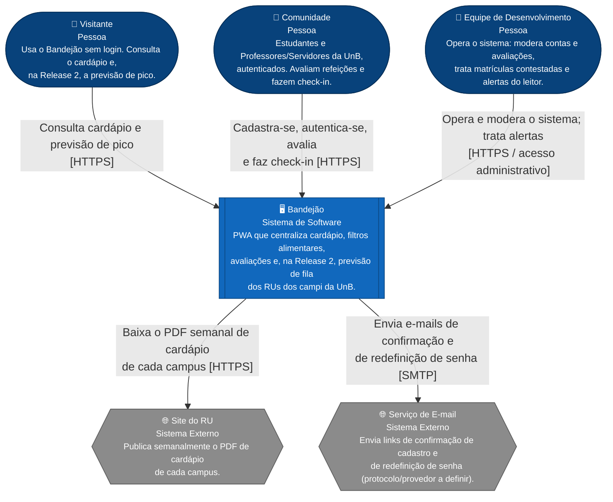
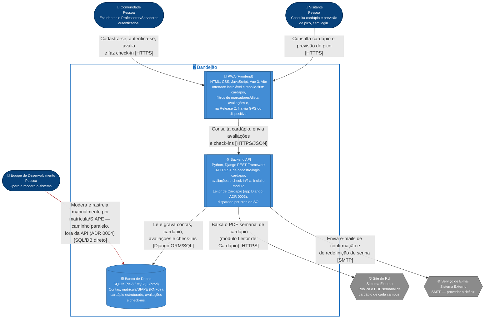

# Arquitetura C4 — Níveis 1 e 2 — Bandejão

> Estes dois níveis são comuns às três frentes do projeto (backend, frontend
> e banco de dados). Os Níveis 3 (Components) e 4 (Code) ficam a cargo de
> cada dupla responsável por sua frente e não são tratados neste documento.
>
> Decisões de arquitetura referenciadas aqui: `docs/adr/0001-escolha-stack-backend.md`,
> `docs/adr/0002-matricula-apelido-extraidos-do-email.md`,
> `docs/adr/0003-leitor-pdf-como-modulo-do-backend.md`,
> `docs/adr/0004-acesso-direto-da-equipe-ao-banco.md`.
>
> A arquitetura (elementos, relações e decisões) é a mesma das versões
> anteriores deste documento. O que muda aqui é a técnica de desenho: em vez
> do tipo `C4Context`/`C4Container` nativo do Mermaid — que, por design do
> próprio C4 Model, renderiza todo elemento como um retângulo, variando
> apenas cor/ícone — os diagramas abaixo usam `flowchart`, o que permite dar
> uma **forma geométrica diferente a cada tipo de elemento**. A leitura
> continua sendo C4 (Contexto e Containers); só o desenho ficou mais fácil
> de distinguir à primeira vista.

### Legenda de formas

| Forma | Tipo de elemento | Exemplo |
|---|---|---|
| ⬭ Oval (estádio) | Pessoa | Visitante, Comunidade, Equipe |
| ▤ Retângulo de barras duplas | Sistema/Container em foco (o Bandejão e suas partes) | Bandejão, PWA, Backend API |
| ⬡ Hexágono | Sistema externo | Site do RU, Serviço de E-mail |
| ⛁ Cilindro | Banco de dados | Banco de Dados |

---

## Nível 1 — Diagrama de Contexto do Sistema

### Notas do diagrama

- **Estudante e Professor/Servidor** aparecem como uma única pessoa,
  **Comunidade** — termo já usado no Documento de Visão (seção 1.3) para o
  mesmo conjunto. O sistema os trata de forma idêntica: muda apenas o tipo de
  identificador (matrícula ou SIAPE) capturado no cadastro. Evitou-se cunhar
  o termo "Usuário cadastrado" porque, no glossário do projeto, "Usuário" é a
  **conta**, não a pessoa (ver `CONTEXT.md`).
- **Pessoas em oval, sistema externo em hexágono, Bandejão em retângulo de
  destaque.** A diferença de forma já indica, antes mesmo de ler o texto,
  quem é usuário humano, o que é o sistema sendo construído e o que é
  integração de terceiros fora do controle da equipe.
- **GPS não é um sistema externo.** A confirmação de check-in por localização
  (RF12, Release 2) usa um recurso do próprio navegador do dispositivo, não
  uma integração com terceiros — por isso não aparece neste diagrama.
- **Ausência deliberada: nenhuma integração com sistemas da UnB para validar
  matrícula/SIAPE.** O sistema confere apenas o formato do identificador
  (RF01); não verifica existência, situação ativa nem titularidade (L01). A
  ausência dessa integração é uma decisão de escopo, não um esquecimento.
- O acesso da Equipe ao banco de dados por fora da API (ADR 0004) é um
  detalhe de implementação de Nível 2; no Nível 1 ele aparece de forma
  genérica, como "opera e modera o sistema".

---

## Nível 2 — Diagrama de Containers

### Notas do diagrama

- **A relação Equipe → Banco de Dados é tracejada e vermelha**, e não uma
  seta cheia como as demais: ela precisa se distinguir do fluxo normal
  (Frontend → Backend → Banco) por ser um **caminho paralelo e independente**,
  que não passa pela API. É a leitura adotada para "consulta administrativa
  manual" e "sem tela administrativa no escopo" (RNF08 e ADR 0004). Hoje é o
  caminho principal de moderação; a equipe já sinalizou a intenção de
  automatizar a moderação de rotina no futuro, deixando esse acesso direto
  reservado a casos extremos de rastreamento por matrícula/SIAPE — a seta
  tracejada e a ADR já refletem essa transição prevista.
- **O Banco de Dados é o único cilindro do diagrama** — reforça, pela forma,
  que é o único armazenamento persistente do sistema, diferente dos dois
  containers de aplicação (PWA e Backend, em retângulo de destaque).
- **Leitor de Cardápio não é um container à parte.** É um módulo (app Django)
  dentro do Backend, com fronteira nítida, conforme ADR 0003. Só seria
  promovido a container separado se a melhor biblioteca de leitura de PDF
  exigisse outra linguagem — o que ainda depende de um teste com o PDF real
  do RU do Gama.
- **O cron do sistema operacional que dispara a leitura do cardápio não
  aparece como elemento no diagrama.** É infraestrutura de deploy, não um
  container da aplicação (ADR 0003).
- **Serviço de E-mail com tecnologia em aberto.** O protocolo (SMTP) é uma
  suposição de trabalho; o provedor concreto ainda não foi escolhido pela
  equipe. Atualizar este diagrama e a ADR correspondente quando essa decisão
  for tomada.
