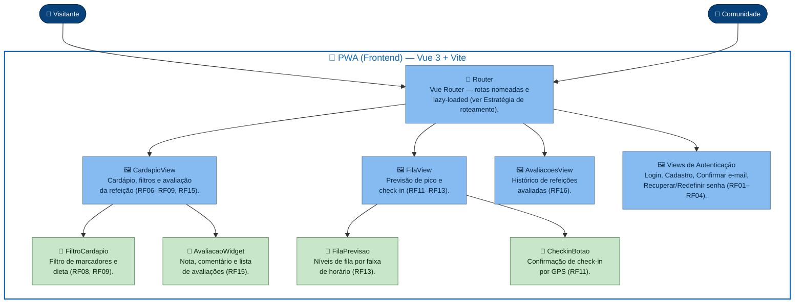
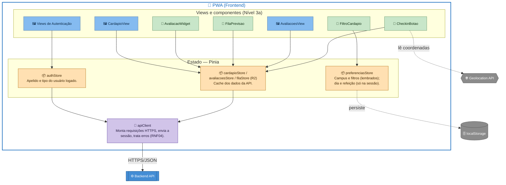
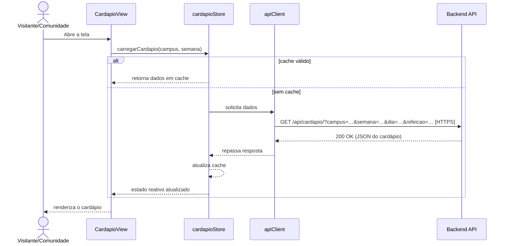
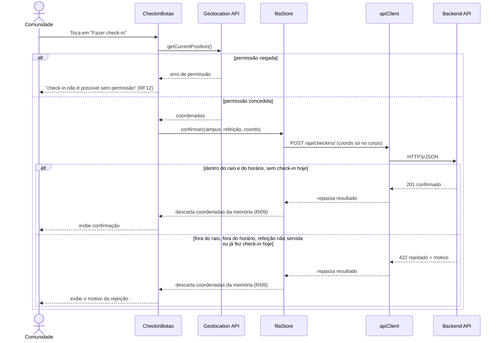
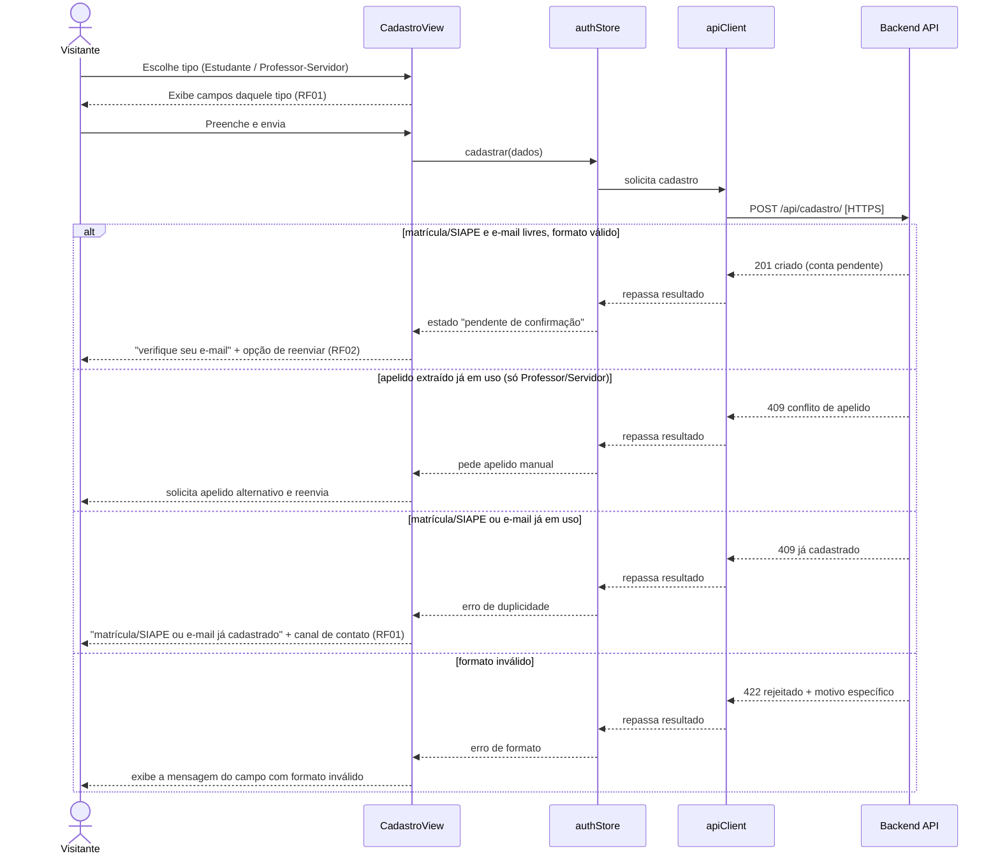
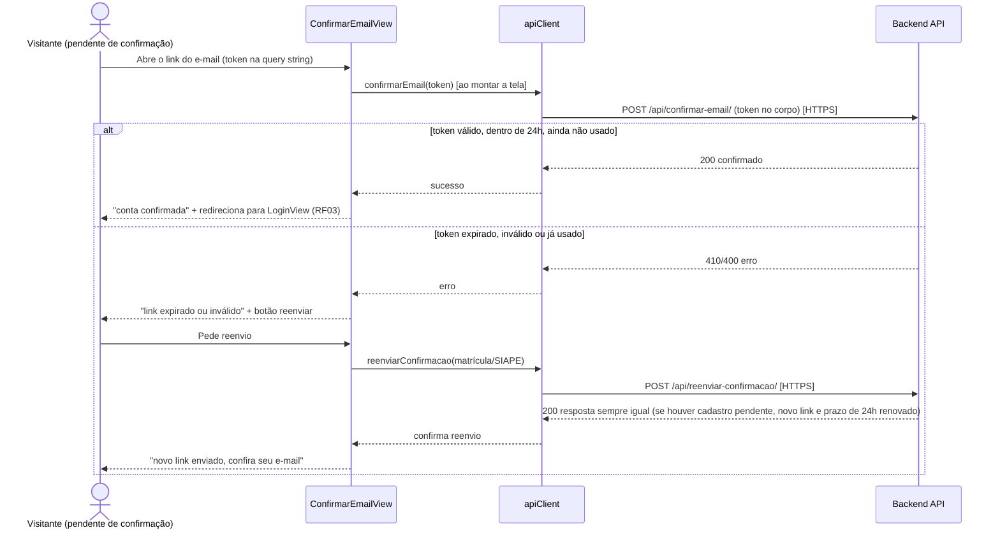

# Arquitetura C4 — Nível 3 (e Nível 4) — Frontend — Bandejão

> Complementa `arquitetura-c4-niveis-1-2-bandejao.md` (comum às três frentes) com o
> detalhamento interno do container **PWA (Frontend)** — Vue 3 + Vite —, conforme
> pedido na issue #31 (Sprint 4). Segue a mesma técnica de desenho adotada no
> Nível 1/2: `flowchart` do Mermaid em vez do tipo `C4Component` nativo, para dar
> uma forma geométrica diferente a cada tipo de elemento. Os fluxos
> dinâmicos (comunicação com a API, check-in por GPS e cadastro/confirmação de
> e-mail) usam `sequenceDiagram`, que é o tipo do Mermaid feito para isso e não
> cruza linhas por design.
>
> **Estado atual do código (`frontend/src`, branch `develop`, Release 1 —
> 28/09/2026):** o protótipo segue esta arquitetura. Existem as Views, o
> Router, os componentes (`FiltroCardapio`, `AvaliacaoWidget` e outros), as
> stores Pinia `auth`, `preferencias`, `cardapio` e `avaliacoes` e o
> `apiClient` único. Como ainda não há backend real, o `apiClient` conversa
> com um **backend simulado** (`src/services/mock/`), que aplica as regras de
> negócio sobre dados fixos; com `VITE_USE_MOCK=false`, ele passa a chamar a
> API real. Há manifest e service worker do PWA.
>
> **Diferenças conhecidas da Release 1**, a resolver na Release 2 (tarefa
> TT-05 do backlog):
> - a sessão usa um token em memória, enviado no cabeçalho `Authorization`;
>   na Release 2 passa a ser o cookie HttpOnly da ADR 0007;
> - os filtros de marcador e de dieta rodam no navegador
>   (`src/utils/cardapio.js`); na Release 2 passam para o backend (ADR 0005);
> - o filtro de marcadores **oculta** o prato com marcador evitado e avisa o
>   que está oculto; o RF08 define que o prato fique visível e sinalizado, e
>   o comportamento final é decidido pela equipe na Release 2;
> - o login e a recuperação de senha simulados usam o e-mail institucional;
>   o RF03 e o RF04 definem matrícula/SIAPE;
> - o cardápio simulado é pedido em `GET /cardapio/{campus}/` (semana
>   inteira); o contrato da Release 2 é `GET /api/cardapio/` com parâmetros
>   de consulta (ADR 0005);
> - o reenvio do link de confirmação simulado pede o e-mail; o RF02 define
>   que ele é pedido pela matrícula/SIAPE;
> - não há `filaStore` (a tela de fila mostra só "em breve").
>
> **Nível 4 é seletivo, por design.** Só entram aqui os fluxos complexos o
> bastante para justificar o detalhamento de código (ver critério no início da
> seção "Nível 4"). Hoje são dois: **check-in por GPS** (RF11/RF12) e
> **cadastro + confirmação de e-mail** (RF01/RF02).

### Legenda de formas

| Forma | Tipo de elemento | Exemplo |
|---|---|---|
| ⬭ Oval (estádio) | Pessoa | Visitante, Comunidade |
| ▤ Retângulo de barras duplas | Container já detalhado no Nível 2 (fora de foco aqui) | Backend API |
| ⬡ Hexágono | Capacidade externa ao app (API do navegador) | Geolocation API |
| ⛁ Cilindro | Armazenamento | localStorage do navegador |
| ▭ Retângulo simples | Componente interno do Frontend (o foco deste diagrama) — cor indica a camada (view, componente, store, serviço) | View, componente Vue, store, serviço |

Para reduzir cruzamento de setas, o Nível 3 foi dividido em dois diagramas:
**(a)** estrutura de telas e componentes (navegação), e **(b)** estado e
comunicação com a API. Cada um sozinho tem poucas arestas e um fluxo único de
cima para baixo.

---

## Nível 3a — Telas, navegação e componentes reutilizáveis

### Notas

- **A avaliação aparece junto ao cardápio da refeição (RF15).** No
  protótipo da Release 1, a rota `/avaliacoes` (`AvaliacoesView`) é a tela
  de avaliações **da refeição selecionada no cardápio** (nota média,
  comentários e formulário, com `AvaliacaoWidget`). O histórico de semanas
  anteriores (RF16, Release 2) ganha rota própria (proposta: `/historico`),
  para não misturar as duas telas.
- **`HomeView` e `NotFoundView`** existem no código, mas ficam de fora do
  diagrama por não agregarem componentes próprios — são apenas destino de
  rota (ver nota do C4 skill: "só criar o que agrega valor").
- **`authViews` agrupa quatro telas com pesos bem diferentes**: `LoginView` e
  `RecuperarSenhaView`/`RedefinirSenhaView` são relativamente lineares;
  `CadastroView` e `ConfirmarEmailView` concentram a maior parte da
  complexidade do épico Login (RF01/RF02) — por isso são elas que ganham
  detalhamento em Nível 4, e não o grupo inteiro.
- Continua em **Nível 3b** o que acontece quando esses componentes precisam
  de dado: quem chama qual store, e como a store fala com o backend.

---

## Nível 3b — Estado e comunicação com a API

### Notas

- **Nenhuma View ou componente chama a API diretamente.** Toda comunicação
  passa por uma *store* e, dali, pela camada única `apiClient` — reflexo, no
  frontend, da separação por módulo já exigida pelo RNF06 no backend.
- **`dadosStore` é um "hub" de propósito**: várias telas e componentes leem
  ou escrevem nele porque ele representa o cache compartilhado de
  cardápio/avaliações/fila — não é bagunça, é o ponto único de verdade dos
  dados vindos da API.
- **`CheckinBotao` é o único componente que fala com a Geolocation API.** As
  coordenadas nascem no navegador, passam para `dadosStore` (linha
  pontilhada, por ser um uso pontual e não uma leitura/escrita de estado
  contínua) e seguem para o `apiClient` só dentro do corpo da requisição —
  nunca ficam gravadas em nenhuma propriedade reativa (RI09).
- **`preferenciasStore → localStorage` também é linha pontilhada**: é
  persistência local do aparelho, não uma chamada de rede, por isso é
  visualmente distinta das setas cheias que representam o fluxo principal
  até o backend.
- **`authStore` não guarda credencial.** Na Release 2, a sessão fica em um
  cookie HttpOnly controlado pelo servidor (ADR 0007): sobrevive a recargas e
  à reabertura do PWA, e nenhum script da página consegue lê-la. O
  `authStore` guarda só o apelido e o tipo do usuário, obtidos em
  `GET /api/sessao/` ao abrir o app. No protótipo da Release 1, a sessão
  simulada usa um token em memória (perdido ao recarregar), que será
  substituído.
- **Backend API aparece em retângulo de barras duplas, sem decompor** — já
  foi decomposto no Nível 2; aqui é só o destino das chamadas do
  `apiClient`.
- **Pinia foi adotado na Release 1** (está no `package.json`). A
  `filaStore` será criada na Release 2, junto com o check-in.

---

## Estratégia de roteamento

O roteamento já está parcialmente implementado em `src/router/index.js` e
este documento formaliza os padrões nele observados, estendendo-os para o
que falta:

- **Rotas nomeadas e com lazy-loading**, via `component: () => import(...)`
  — cada rota carrega sua View sob demanda, e não no bundle inicial.
- **`meta.title` por rota**, lido em `router.afterEach` para atualizar
  `document.title` (`"<título> · Bandejão"`), já implementado.
- **Campus como parâmetro de rota, não só de estado**: `/cardapio/:campusId`
  permite compartilhar/favoritar o link de um campus específico, enquanto a
  preferência "último campus visto" (RF07) fica em `preferenciasStore` para
  quando não há parâmetro na URL (rota raiz `/`).
- **Guarda de navegação para rotas autenticadas (a implementar):** nenhuma
  rota da Release atual precisa bloquear a *navegação* em si — RF05 pede
  convite ao cadastro/login, não erro genérico, mesmo para ações que exigem
  login (avaliar, check-in). Por isso os componentes de ação leem
  `authStore.estaAutenticado` e, se falso, exibem um convite inline, em vez
  de a rota redirecionar sozinha — isso mantém a tela acessível ao visitante
  (RI06) e cumpre o RF05 literalmente.
- **Rota `/confirmar-email` lê o token pela query string** (ex.
  `?token=...`), não por parâmetro de rota — o link enviado por e-mail
  (RF02) aponta direto para essa URL; nenhuma navegação interna do app
  precisa gerar esse link, só o backend.
- **Rota coringa `/:pathMatch(.*)*`** para 404 (`NotFoundView`), já
  implementada.

---

## Estratégia de gerenciamento de estado

**Pinia**, a biblioteca de estado oficial do ecossistema Vue 3, adotada na
Release 1. Divisão em stores por responsabilidade,
espelhando a separação por app do backend (RNF06):

| Store | Responsabilidade | Persistência |
|---|---|---|
| `authStore` | Apelido e tipo do usuário autenticado | A sessão fica em cookie HttpOnly do servidor e sobrevive a recargas (ADR 0007). Na Release 1, token simulado em memória |
| `preferenciasStore` | Campus e filtros de marcador e dieta (lembrados); dia e refeição selecionados (só na sessão de navegação) | Campus e filtros em `localStorage` (RF07, RF08, RF09, RNF03); dia e refeição em memória, porque a refeição exibida segue a regra do RF07 |
| `cardapioStore` | Cache do cardápio já lido da API, por campus/semana | Em memória, por sessão de navegação |
| `avaliacoesStore` | Avaliações da refeição em exibição; envio/edição da avaliação do usuário | Em memória |
| `filaStore` (Release 2) | Previsão de pico e resultado do check-in mais recente | Em memória; nunca guarda coordenadas (RI09) |

Critério de decisão: **o que precisa sobreviver a um recarregamento de
página vira `localStorage`; o resto fica em memória.** Isso restringe a
persistência ao mínimo pedido pelos requisitos (RF07–RF09) e evita guardar,
mesmo sem querer, dado sensível (sessão, coordenadas) fora do que a LGPD e o
RNF07/RI09 permitem.

---

## Fluxo de comunicação com a API do backend

Padrão único para toda chamada, ilustrado aqui com a consulta de cardápio
(fluxo mais simples, sem autenticação):

O `apiClient` é o único ponto que conhece a URL base da API, envia o cookie
de sessão e o token CSRF nas requisições que alteram dados (ADR 0007), e
trata erros de forma centralizada (rede indisponível, 401 → sessão expirada, 4xx →
mensagem específica do backend) — nunca a View trata `fetch` diretamente.
Esse mesmo padrão vale para escrita (avaliação, check-in, cadastro),
variando apenas o verbo HTTP e a store de origem.

---

## Nível 4 — Fluxos detalhados

O C4 Model recomenda Nível 4 só onde o código concentra complexidade real —
não para todo componente. Aqui, dois fluxos passam nesse critério: cada um
envolve (a) uma restrição externa ao controle da equipe (hardware do
usuário ou tempo de expiração de um link), (b) uma regra de negócio de
tratamento de dado sensível (RI09 no check-in; formato-apenas de
matrícula/SIAPE, sem verificação de identidade, no cadastro — ver L01) e
(c) mais de um desfecho possível que a interface precisa tratar de forma
diferente. Os demais fluxos (login, recuperação de senha, filtros,
avaliação) são majoritariamente request/response linear e já estão bem
representados pelo padrão genérico da seção anterior.

### 4a — Check-in com confirmação por GPS

Dos componentes do sistema, o check-in (RF11 + RF12) é o que mais justifica
um detalhamento de Nível 4: envolve permissão do navegador, uma API externa
ao controle da equipe (Geolocation), uma regra de negócio de descarte
imediato do dado sensível (RI09) e duas condições de rejeição (fora do raio
ou fora do horário, além de check-in já feito no dia).

#### Notas do fluxo

- **O descarte das coordenadas (RI09) acontece nos dois desfechos**, sucesso
  ou rejeição — não é um efeito colateral do caminho feliz, é uma regra que
  vale sempre, por isso aparece nas duas metades do `alt`.
- **A validação de raio e de horário é feita no backend, não no frontend.**
  `CheckinBotao` só encaminha as coordenadas; ele não decide se o usuário
  está dentro do raio, evitando duplicar no cliente uma regra que pertence
  à API (RNF06) e que depende de parâmetro configurável por campus (Anexo A
  do Documento de Requisitos).
- **Um usuário sem permissão de localização nunca chega a enviar a
  requisição.** O fluxo para no primeiro `alt` com uma mensagem que orienta
  a conceder permissão, sem contar como tentativa de check-in.

### 4b — Cadastro e confirmação de e-mail

RF01 e RF02 concentram, juntos, a lógica de UI mais ramificada do épico
Login: um formulário de duas etapas com campos condicionais por tipo de
usuário, extração automática de matrícula (Estudante) ou apelido
(Professor/Servidor) a partir do e-mail informado, três desfechos distintos
de submissão, e um ciclo de vida assíncrono da conta (pendente → confirmada
ou expirada) que a interface precisa refletir sem que o usuário perca o
progresso. Diferente do check-in, a restrição externa aqui não é hardware —
é o **tempo**: o link de confirmação vale 24h (RF02), e cada reenvio o
renova.

O acesso ao próprio link de confirmação é um segundo fluxo, independente do
formulário acima — o usuário chega a ele pelo e-mail, não navegando dentro
do app:

#### Notas do fluxo

- **O reenvio de link tem duas entradas na interface, não uma só**: pela
  própria `ConfirmarEmailView` quando o token já expirou (acima), e pela
  `LoginView`, quando alguém tenta entrar com credenciais corretas numa
  conta ainda não confirmada — nesse caso a tela de login, não a de
  cadastro, é quem oferece o reenvio (RF02). As duas chamam o mesmo
  `authStore.reenviarConfirmacao()`, evitando duplicar a lógica.
- **O frontend não decide se um formato de matrícula/SIAPE ou e-mail é
  válido — ele só reflete a resposta do backend.** As regras de validação
  (checagem dos 3 primeiros dígitos da matrícula, sequências rejeitadas nos
  6 dígitos restantes, domínio do e-mail por tipo de usuário) pertencem à
  API (RNF06); duplicá-las no cliente criaria duas fontes de verdade para a
  mesma regra. O `CadastroView` só formata o campo (ex. limitar a dígitos
  numéricos) para reduzir erros óbvios antes do envio.
- **A mensagem de rejeição nunca revela qual campo colidiu com uma conta
  existente** (RF01: mensagem combinada, por analogia à proteção contra
  enumeração de contas do RF03) — "matrícula ou e-mail já cadastrados", nunca "esta matrícula já
  existe" isoladamente, para não confirmar a existência de uma matrícula
  específica a quem não é o dono dela.
- **A colisão de apelido é o único caso em que o cadastro é reapresentado
  com um campo a mais**, não apenas re-exibido com erro — o formulário
  precisa manter os demais campos preenchidos e adicionar o campo de
  apelido manual, já que esse dado normalmente nem aparece na tela para
  Professor/Servidor (é extraído automaticamente).
- **Nenhum dado do formulário é persistido em `localStorage` durante o
  fluxo.** Diferente de `preferenciasStore`, os campos de cadastro (que
  incluem senha) ficam apenas em estado de componente, descartados ao sair
  da tela — mesmo raciocínio de minimização de dado sensível do RI09,
  aplicado aqui por analogia, ainda que não exista um RI dedicado à senha
  digitada em formulário.

---

## Rastreabilidade — componentes × requisitos

| Componente | Requisitos atendidos | Nível 4? |
|---|---|---|
| `CardapioView` | RF05, RF07, RF10, RF18 | — |
| `FiltroCardapio` | RF08 (na Release 1 oculta o prato e avisa; ver "Diferenças conhecidas"), RF09 | — |
| `AvaliacaoWidget` | RF15, RI01, RI10 | — |
| `AvaliacoesView` | RF15 (avaliações da refeição selecionada) | — |
| Tela de histórico (Release 2, proposta `/historico`) | RF16 | — |
| `FilaView` / `FilaPrevisao` | RF13, L08 | — |
| `CheckinBotao` | RF11, RF12, RI03, RI09 | ✅ 4a |
| `CadastroView` | RF01, RI01, RI07, L01 | ✅ 4b |
| `ConfirmarEmailView` | RF02 | ✅ 4b |
| Demais Views de Autenticação (Login, Recuperar/Redefinir senha) | RF03, RF04 | — |
| `authStore` | RF01, RF02, RF03, RNF04, ADR 0007 | — |
| `preferenciasStore` | RF07, RF08, RF09, RNF03 | — |
| `apiClient` | RNF01, RNF04 | — |
